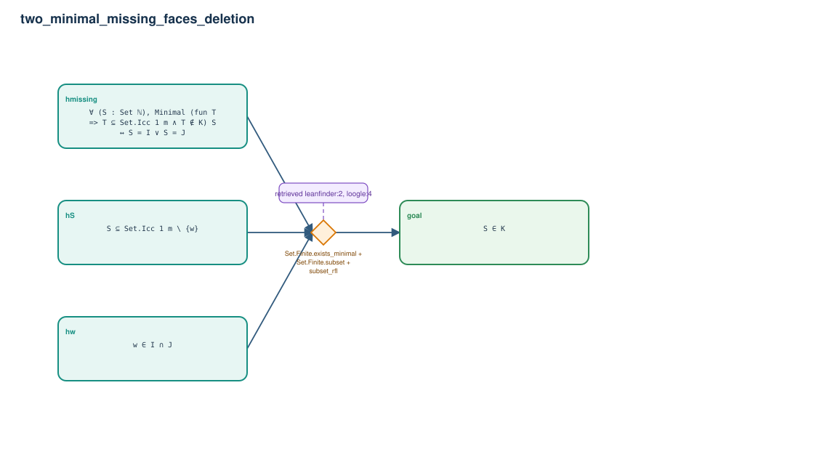

# two_minimal_missing_faces_deletion

- Problem index: `381`
- arXiv source: `1701.07720`
- Selected nodes / hyperedges: **4 / 1**
- Selected depth: **1**
- Retrieval events matched: **2 / 5**
- Incomplete target InfoTree snapshots audited/excluded: **0**
- Validation: original proof re-elaborated; every edge witness kernel-checked in its Lean local context; selected topology compiled as a separate Lean theorem.
- Axioms: `Classical.choice, Quot.sound, propext`
- Concrete certificate: [semantic_graph_certificate.lean](semantic_graph_certificate.lean) embeds the accepted proof and checks every selected raw witness, premise list, and conclusion against this graph.

## Hyperedges

| Edge | Premises | Conclusion | Rule | Retrieval |
|---|---|---|---|---|
| `h_goal` | hmissing, hw, hS | goal | `Set.Finite.exists_minimal + Set.Finite.subset + subset_rfl` | leanfinder:2, loogle:4 |
