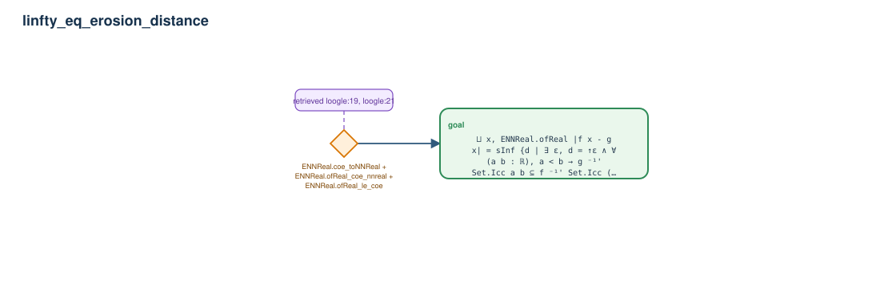

# linfty_eq_erosion_distance

- Problem index: `390`
- arXiv source: `1710.01577`
- Selected nodes / hyperedges: **1 / 1**
- Selected depth: **1**
- Retrieval events matched: **8 / 22**
- Incomplete target InfoTree snapshots audited/excluded: **0**
- Validation: original proof re-elaborated; every edge witness kernel-checked in its Lean local context; selected topology compiled as a separate Lean theorem.
- Axioms: `Classical.choice, Quot.sound, propext`
- Concrete certificate: [semantic_graph_certificate.lean](semantic_graph_certificate.lean) embeds the accepted proof and checks every selected raw witness, premise list, and conclusion against this graph.

## Hyperedges

| Edge | Premises | Conclusion | Rule | Retrieval |
|---|---|---|---|---|
| `h_goal` | ∅ | goal | `ENNReal.coe_toNNReal + ENNReal.ofReal_coe_nnreal + ENNReal.ofReal_le_coe` | loogle:19, loogle:21, loogle:12, loogle:13, leanfinder:14, loogle:11, loogle:9, loogle:10 |
