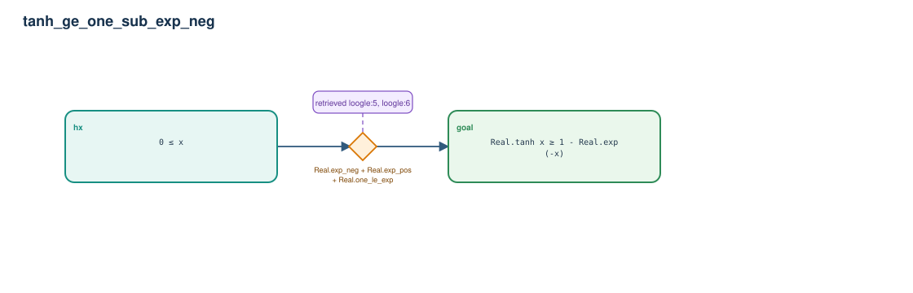

# tanh_ge_one_sub_exp_neg

- Problem index: `925`
- arXiv source: `2209.07782`
- Selected nodes / hyperedges: **2 / 1**
- Selected depth: **1**
- Retrieval events matched: **5 / 11**
- Incomplete target InfoTree snapshots audited/excluded: **0**
- Validation: original proof re-elaborated; every edge witness kernel-checked in its Lean local context; selected topology compiled as a separate Lean theorem.
- Axioms: `Classical.choice, Quot.sound, propext`
- Concrete certificate: [semantic_graph_certificate.lean](semantic_graph_certificate.lean) embeds the accepted proof and checks every selected raw witness, premise list, and conclusion against this graph.

## Hyperedges

| Edge | Premises | Conclusion | Rule | Retrieval |
|---|---|---|---|---|
| `h_goal` | hx | goal | `Real.exp_neg + Real.exp_pos + Real.one_le_exp` | loogle:5, loogle:6, loogle:8, leanfinder:1, loogle:4 |
