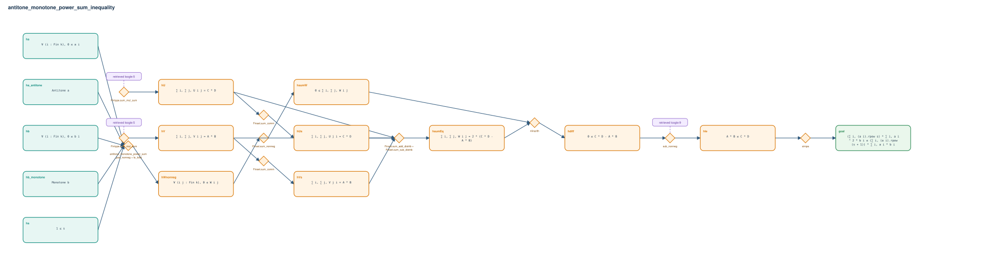

# antitone_monotone_power_sum_inequality

- Problem index: `960`
- arXiv source: `1005.2954`
- Selected nodes / hyperedges: **15 / 10**
- Selected depth: **6**
- Retrieval events matched: **2 / 17**
- Incomplete target InfoTree snapshots audited/excluded: **0**
- Validation: original proof re-elaborated; every edge witness kernel-checked in its Lean local context; selected topology compiled as a separate Lean theorem.
- Axioms: `Classical.choice, Quot.sound, propext`
- Concrete certificate: [semantic_graph_certificate.lean](semantic_graph_certificate.lean) embeds the accepted proof and checks every selected raw witness, premise list, and conclusion against this graph.

## Hyperedges

| Edge | Premises | Conclusion | Rule | Retrieval |
|---|---|---|---|---|
| `h_001_hwnonneg` | hs, ha, hb, ha_antitone, hb_monotone | hWnonneg | `antitone_monotone_power_sum_pair_nonneg + le_total` | — |
| `h_002_hsumw` | hWnonneg | hsumW | `Finset.sum_nonneg` | — |
| `h_003_hu` | ∅ | hU | `Fintype.sum_mul_sum` | loogle:5 |
| `h_004_hus` | hU | hUs | `Finset.sum_comm` | — |
| `h_005_hv` | ∅ | hV | `Fintype.sum_mul_sum` | loogle:5 |
| `h_006_hvs` | hV | hVs | `Finset.sum_comm` | — |
| `h_007_hsumeq` | hU, hUs, hV, hVs | hsumEq | `Finset.sum_add_distrib + Finset.sum_sub_distrib` | — |
| `h_008_hdiff` | hsumW, hsumEq | hdiff | `nlinarith` | — |
| `h_009_hle` | hdiff | hle | `sub_nonneg` | loogle:9 |
| `h_goal` | hle | goal | `simpa` | — |
