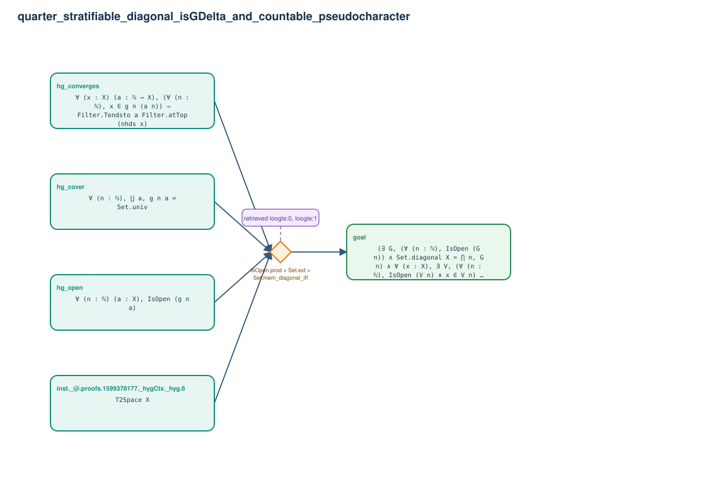

# quarter_stratifiable_diagonal_isGDelta_and_countable_pseudocharacter

- Problem index: `1335`
- arXiv source: `0810.3024`
- Selected nodes / hyperedges: **5 / 1**
- Selected depth: **1**
- Retrieval events matched: **5 / 7**
- Incomplete target InfoTree snapshots audited/excluded: **0**
- Validation: original proof re-elaborated; every edge witness kernel-checked in its Lean local context; selected topology compiled as a separate Lean theorem.
- Axioms: `Classical.choice, Quot.sound, propext`
- Concrete certificate: [semantic_graph_certificate.lean](semantic_graph_certificate.lean) embeds the accepted proof and checks every selected raw witness, premise list, and conclusion against this graph.

## Hyperedges

| Edge | Premises | Conclusion | Rule | Retrieval |
|---|---|---|---|---|
| `h_goal` | inst._@.proofs.1599378177._hygCtx._hyg.6, hg_open, hg_cover, hg_converges | goal | `IsOpen.prod + Set.ext + Set.mem_diagonal_iff` | loogle:0, loogle:1, loogle:5, loogle:4, loogle:3 |
