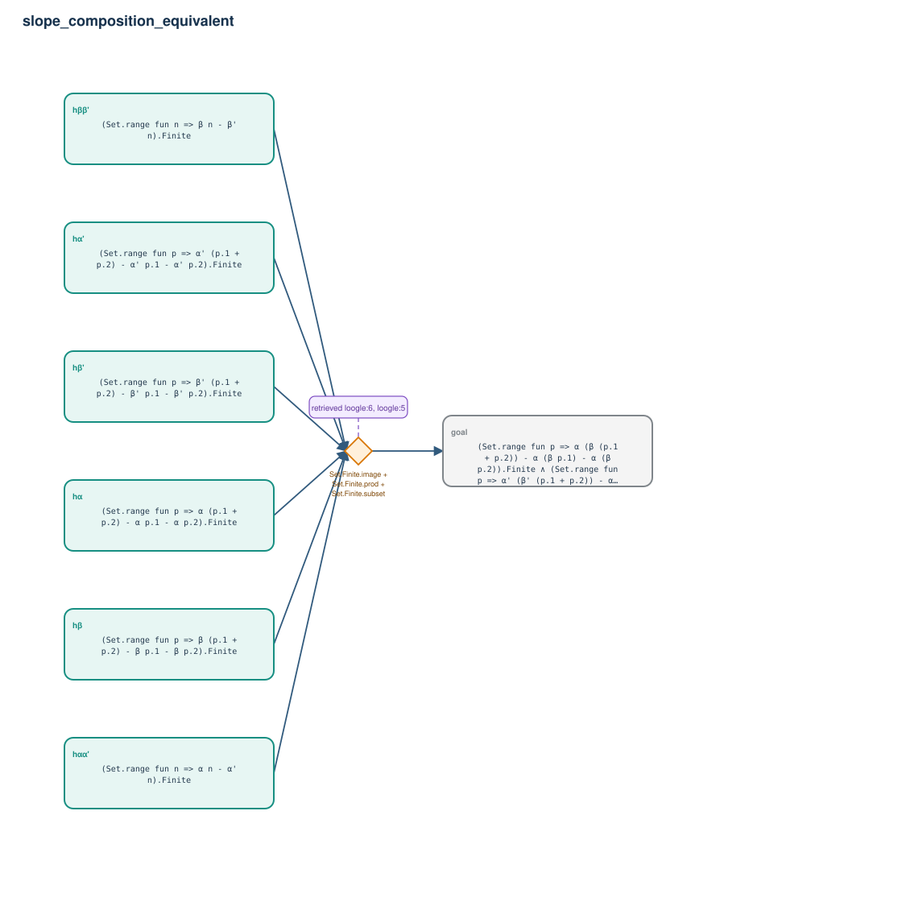

# slope_composition_equivalent

- Problem index: `1489`
- arXiv source: `math_0301015`
- Selected nodes / hyperedges: **7 / 1**
- Selected depth: **1**
- Retrieval events matched: **5 / 10**
- Incomplete target InfoTree snapshots audited/excluded: **0**
- Validation: original proof re-elaborated; every edge witness kernel-checked in its Lean local context; selected topology compiled as a separate Lean theorem.
- Axioms: `Classical.choice, Quot.sound, propext`
- Concrete certificate: [semantic_graph_certificate.lean](semantic_graph_certificate.lean) embeds the accepted proof and checks every selected raw witness, premise list, and conclusion against this graph.

## Hyperedges

| Edge | Premises | Conclusion | Rule | Retrieval |
|---|---|---|---|---|
| `h_goal` | hα, hα', hβ, hβ', hαα', hββ' | goal | `Set.Finite.image + Set.Finite.prod + Set.Finite.subset` | loogle:6, loogle:5, loogle:4, loogle:9, loogle:7 |
