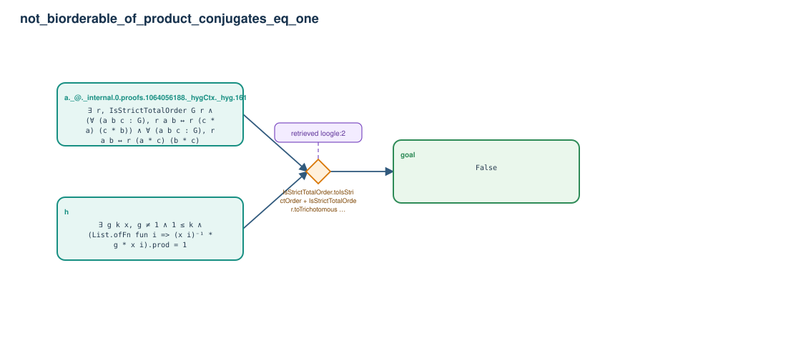

# not_biorderable_of_product_conjugates_eq_one

- Problem index: `1572`
- arXiv source: `1401.0570`
- Selected nodes / hyperedges: **3 / 1**
- Selected depth: **1**
- Retrieval events matched: **1 / 5**
- Incomplete target InfoTree snapshots audited/excluded: **0**
- Validation: original proof re-elaborated; every edge witness kernel-checked in its Lean local context; selected topology compiled as a separate Lean theorem.
- Axioms: `Classical.choice, Quot.sound, propext`
- Concrete certificate: [semantic_graph_certificate.lean](semantic_graph_certificate.lean) embeds the accepted proof and checks every selected raw witness, premise list, and conclusion against this graph.

## Hyperedges

| Edge | Premises | Conclusion | Rule | Retrieval |
|---|---|---|---|---|
| `h_goal` | h, a._@._internal.0.proofs.1064056188._hygCtx._hyg.161 | goal | `IsStrictTotalOrder.toIsStrictOrder + IsStrictTotalOrder.toTrichotomous + List.mem_ofFn` | loogle:2 |
