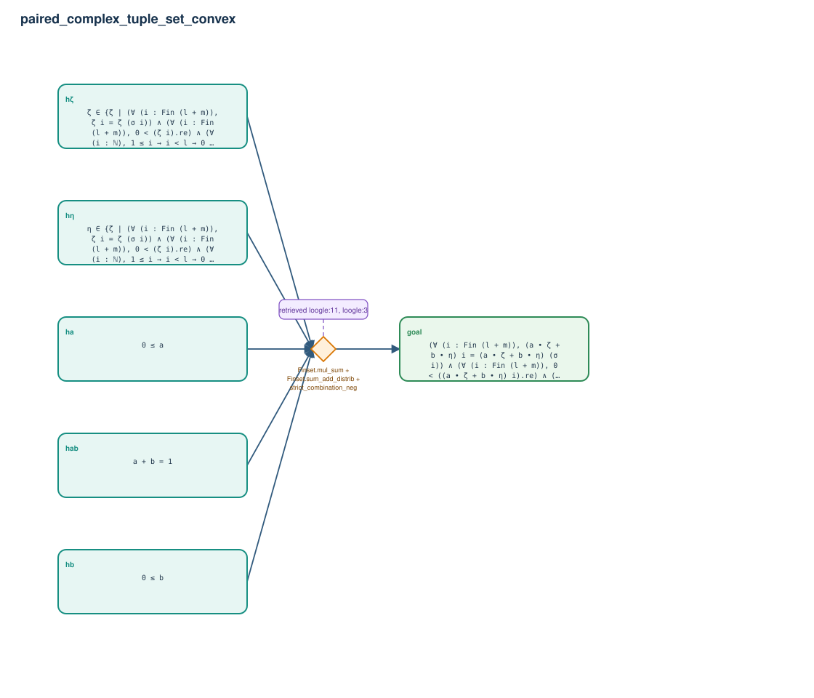

# paired_complex_tuple_set_convex

- Problem index: `1664`
- arXiv source: `0708.3541`
- Selected nodes / hyperedges: **6 / 1**
- Selected depth: **1**
- Retrieval events matched: **2 / 6**
- Incomplete target InfoTree snapshots audited/excluded: **0**
- Validation: original proof re-elaborated; every edge witness kernel-checked in its Lean local context; selected topology compiled as a separate Lean theorem.
- Axioms: `Classical.choice, Quot.sound, propext`
- Concrete certificate: [semantic_graph_certificate.lean](semantic_graph_certificate.lean) embeds the accepted proof and checks every selected raw witness, premise list, and conclusion against this graph.

## Hyperedges

| Edge | Premises | Conclusion | Rule | Retrieval |
|---|---|---|---|---|
| `h_goal` | hζ, hη, ha, hb, hab | goal | `Finset.mul_sum + Finset.sum_add_distrib + strict_combination_neg` | loogle:11, loogle:3 |
