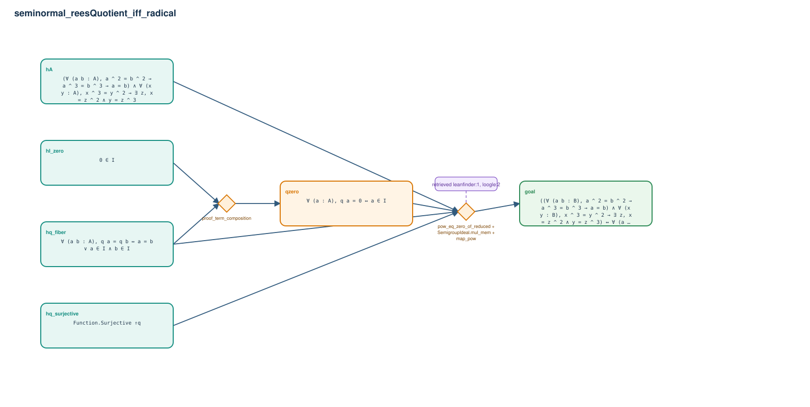

# seminormal_reesQuotient_iff_radical

- Problem index: `1789`
- arXiv source: `1207.2891`
- Selected nodes / hyperedges: **6 / 2**
- Selected depth: **2**
- Retrieval events matched: **6 / 10**
- Incomplete target InfoTree snapshots audited/excluded: **0**
- Validation: original proof re-elaborated; every edge witness kernel-checked in its Lean local context; selected topology compiled as a separate Lean theorem.
- Axioms: `Classical.choice, Quot.sound, propext`
- Concrete certificate: [semantic_graph_certificate.lean](semantic_graph_certificate.lean) embeds the accepted proof and checks every selected raw witness, premise list, and conclusion against this graph.

## Hyperedges

| Edge | Premises | Conclusion | Rule | Retrieval |
|---|---|---|---|---|
| `h_001_qzero` | hI_zero, hq_fiber | qzero | `proof_term_composition` | — |
| `h_goal` | hA, hq_surjective, hq_fiber, qzero | goal | `pow_eq_zero_of_reduced + SemigroupIdeal.mul_mem + map_pow` | leanfinder:1, loogle:2, loogle:12, loogle:3, loogle:9, loogle:11 |
