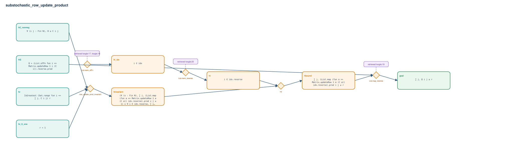

# substochastic_row_update_product

- Problem index: `3210`
- arXiv source: `1410.4329`
- Selected nodes / hyperedges: **9 / 5**
- Selected depth: **4**
- Retrieval events matched: **4 / 16**
- Incomplete target InfoTree snapshots audited/excluded: **0**
- Validation: original proof re-elaborated; every edge witness kernel-checked in its Lean local context; selected topology compiled as a separate Lean theorem.
- Axioms: `Classical.choice, Quot.sound, propext`
- Concrete certificate: [semantic_graph_certificate.lean](semantic_graph_certificate.lean) embeds the accepted proof and checks every selected raw witness, premise list, and conclusion against this graph.

## Hyperedges

| Edge | Premises | Conclusion | Rule | Retrieval |
|---|---|---|---|---|
| `h_001_hinvariant` | hC_nonneg, hr, hr_lt_one | hinvariant | `row_update_prod_invariant` | — |
| `h_002_hi_idx` | ∅ | hi_idx | `List.mem_ofFn` | loogle:17, loogle:18 |
| `h_003_hi` | hi_idx | hi | `List.mem_reverse` | loogle:20 |
| `h_004_hbound` | hinvariant, hi | hbound | `rw` | — |
| `h_goal` | hQ, hbound | goal | `List.map_reverse` | loogle:19 |
