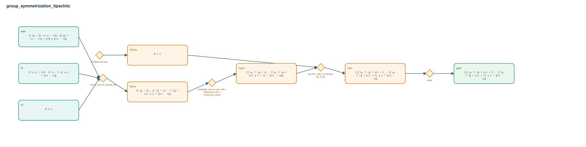

# group_symmetrization_lipschitz

- Problem index: `3260`
- arXiv source: `2302.01915`
- Selected nodes / hyperedges: **8 / 5**
- Selected depth: **4**
- Retrieval events matched: **0 / 1**
- Incomplete target InfoTree snapshots audited/excluded: **0**
- Validation: original proof re-elaborated; every edge witness kernel-checked in its Lean local context; selected topology compiled as a separate Lean theorem.
- Axioms: `Classical.choice, Quot.sound, propext`
- Concrete certificate: [semantic_graph_certificate.lean](semantic_graph_certificate.lean) embeds the accepted proof and checks every selected raw witness, premise list, and conclusion against this graph.

## Hyperedges

| Edge | Premises | Conclusion | Rule | Retrieval |
|---|---|---|---|---|
| `h_001_hcpos` | ∅ | hCpos | `Fintype.card_pos` | — |
| `h_002_hterm` | hact, hL, hf | hterm | `mul_le_mul_of_nonneg_left` | — |
| `h_003_hsum` | hterm | hsum | `Finset.abs_sum_le_sum_abs + Finset.card_univ + Finset.sum_const` | — |
| `h_004_hdiv` | hCpos, hsum | hdiv | `abs_div + abs_of_nonneg + div_le_iff₀` | — |
| `h_goal` | hdiv | goal | `exact` | — |
