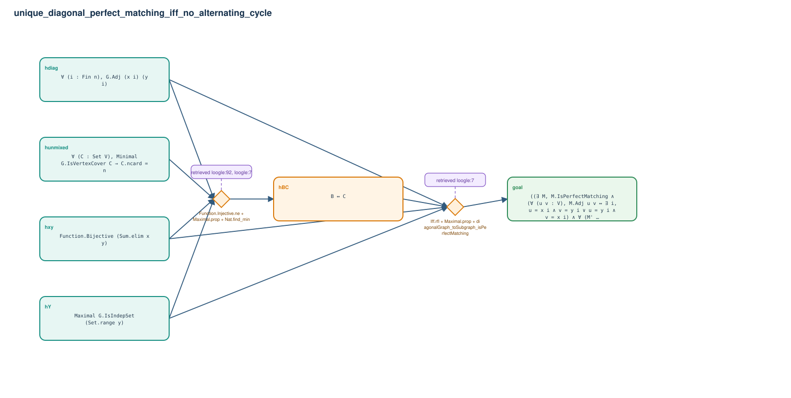

# unique_diagonal_perfect_matching_iff_no_alternating_cycle

- Problem index: `19`
- arXiv source: `0909.4368`
- Selected nodes / hyperedges: **6 / 2**
- Selected depth: **2**
- Retrieval events matched: **2 / 120**
- Incomplete target InfoTree snapshots audited/excluded: **0**
- Validation: original proof re-elaborated; every edge witness kernel-checked in its Lean local context; selected topology compiled as a separate Lean theorem.
- Axioms: `Classical.choice, Quot.sound, propext`
- Concrete certificate: [semantic_graph_certificate.lean](semantic_graph_certificate.lean) embeds the accepted proof and checks every selected raw witness, premise list, and conclusion against this graph.

## Hyperedges

| Edge | Premises | Conclusion | Rule | Retrieval |
|---|---|---|---|---|
| `h_001_hbc` | hxy, hY, hdiag, hunmixed | hBC | `Function.Injective.ne + Maximal.prop + Nat.find_min` | loogle:92, loogle:7 |
| `h_goal` | hxy, hY, hdiag, hBC | goal | `Iff.rfl + Maximal.prop + diagonalGraph_toSubgraph_isPerfectMatching` | loogle:7 |
