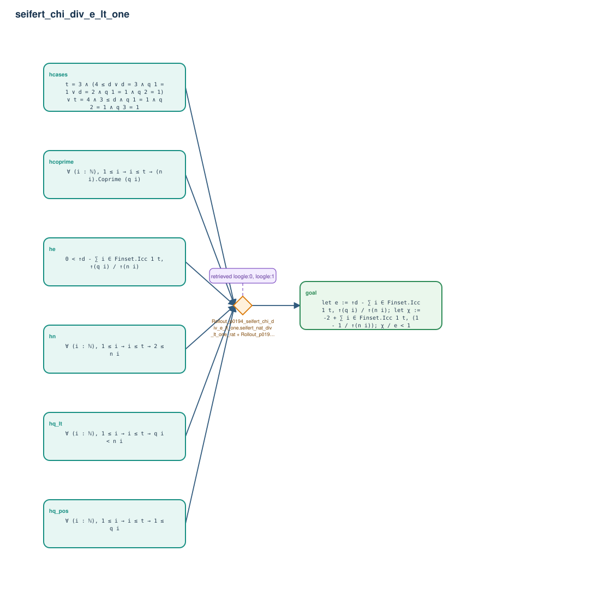

# seifert_chi_div_e_lt_one

- Problem index: `194`
- arXiv source: `1110.2979`
- Selected nodes / hyperedges: **7 / 1**
- Selected depth: **1**
- Retrieval events matched: **2 / 3**
- Incomplete target InfoTree snapshots audited/excluded: **0**
- Validation: original proof re-elaborated; every edge witness kernel-checked in its Lean local context; selected topology compiled as a separate Lean theorem.
- Axioms: `Classical.choice, Quot.sound, propext`
- Concrete certificate: [semantic_graph_certificate.lean](semantic_graph_certificate.lean) embeds the accepted proof and checks every selected raw witness, premise list, and conclusion against this graph.

## Hyperedges

| Edge | Premises | Conclusion | Rule | Retrieval |
|---|---|---|---|---|
| `h_goal` | hn, hq_pos, hq_lt, hcoprime, he, hcases | goal | `Rollout_p0194_seifert_chi_div_e_lt_one.seifert_nat_div_lt_one_rat + Rollout_p0194_seifert_chi_div_e_lt_one.seifert_nat_inv_pos_rat + div_lt_one` | loogle:0, loogle:1 |
