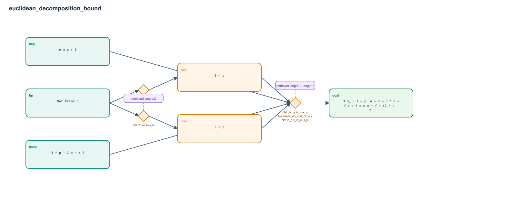

# euclidean_decomposition_bound

- Problem index: `229`
- arXiv source: `1908.02803`
- Selected nodes / hyperedges: **6 / 3**
- Selected depth: **2**
- Retrieval events matched: **5 / 6**
- Incomplete target InfoTree snapshots audited/excluded: **0**
- Validation: original proof re-elaborated; every edge witness kernel-checked in its Lean local context; selected topology compiled as a separate Lean theorem.
- Axioms: `Classical.choice, Quot.sound, propext`
- Concrete certificate: [semantic_graph_certificate.lean](semantic_graph_certificate.lean) embeds the accepted proof and checks every selected raw witness, premise list, and conclusion against this graph.

## Hyperedges

| Edge | Premises | Conclusion | Rule | Retrieval |
|---|---|---|---|---|
| `h_001_hp0` | hp | hp0 | `proof_term_composition` | — |
| `h_002_hp2` | hp | hp2 | `Nat.Prime.two_le` | loogle:2 |
| `h_goal` | hp, hsize, hep, hp0, hp2 | goal | `Nat.div_add_mod + Nat.exists_eq_add_of_le + Nat.le_div_iff_mul_le` | loogle:1, loogle:7, loogle:0, loogle:3 |
