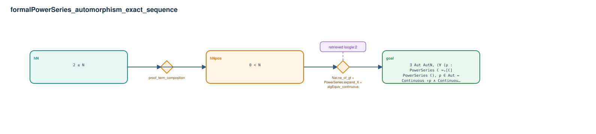

# formalPowerSeries_automorphism_exact_sequence

- Problem index: `246`
- arXiv source: `math_0112211`
- Selected nodes / hyperedges: **3 / 2**
- Selected depth: **2**
- Retrieval events matched: **1 / 213**
- Incomplete target InfoTree snapshots audited/excluded: **0**
- Validation: original proof re-elaborated; every edge witness kernel-checked in its Lean local context; selected topology compiled as a separate Lean theorem.
- Axioms: `Classical.choice, Quot.sound, propext`
- Concrete certificate: [semantic_graph_certificate.lean](semantic_graph_certificate.lean) embeds the accepted proof and checks every selected raw witness, premise list, and conclusion against this graph.

## Hyperedges

| Edge | Premises | Conclusion | Rule | Retrieval |
|---|---|---|---|---|
| `h_001_hnpos` | hN | hNpos | `proof_term_composition` | — |
| `h_goal` | hN, hNpos | goal | `Nat.ne_of_gt + PowerSeries.expand_X + algEquiv_continuous` | loogle:2 |
