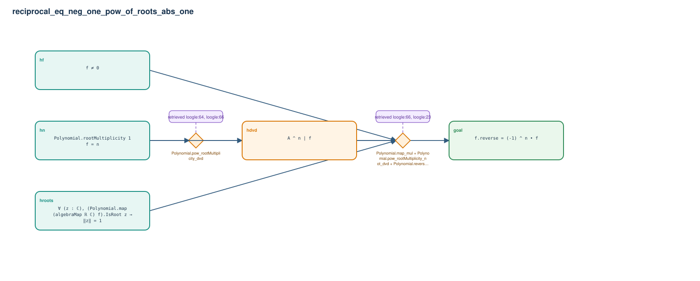

# reciprocal_eq_neg_one_pow_of_roots_abs_one

- Problem index: `252`
- arXiv source: `math_0511542`
- Selected nodes / hyperedges: **5 / 2**
- Selected depth: **2**
- Retrieval events matched: **7 / 116**
- Incomplete target InfoTree snapshots audited/excluded: **0**
- Validation: original proof re-elaborated; every edge witness kernel-checked in its Lean local context; selected topology compiled as a separate Lean theorem.
- Axioms: `Classical.choice, Quot.sound, propext`
- Concrete certificate: [semantic_graph_certificate.lean](semantic_graph_certificate.lean) embeds the accepted proof and checks every selected raw witness, premise list, and conclusion against this graph.

## Hyperedges

| Edge | Premises | Conclusion | Rule | Retrieval |
|---|---|---|---|---|
| `h_001_hdvd` | hn | hdvd | `Polynomial.pow_rootMultiplicity_dvd` | loogle:64, loogle:66 |
| `h_goal` | hf, hroots, hn, hdvd | goal | `Polynomial.map_mul + Polynomial.pow_rootMultiplicity_not_dvd + Polynomial.reverse_mul_of_domain` | loogle:66, loogle:23, leanfinder:69, loogle:6, loogle:140, loogle:141 |
