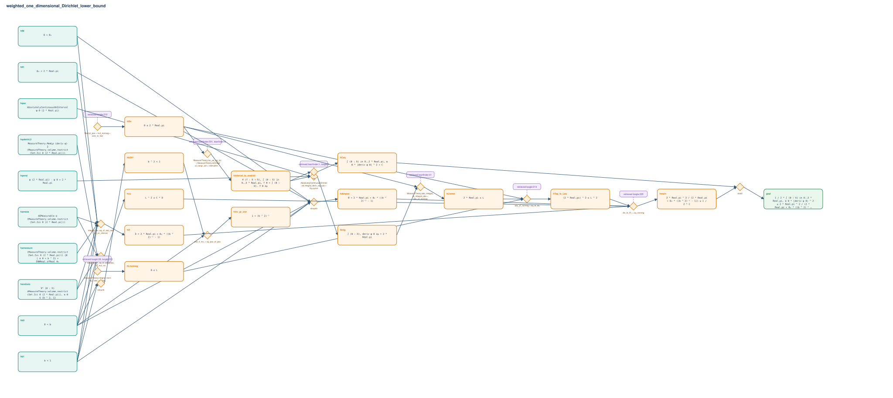

# weighted_one_dimensional_Dirichlet_lower_bound

- Problem index: `273`
- arXiv source: `1104.4255`
- Selected nodes / hyperedges: **24 / 14**
- Selected depth: **7**
- Retrieval events matched: **12 / 201**
- Incomplete target InfoTree snapshots audited/excluded: **0**
- Validation: original proof re-elaborated; every edge witness kernel-checked in its Lean local context; selected topology compiled as a separate Lean theorem.
- Axioms: `Classical.choice, Quot.sound, propext`
- Concrete certificate: [semantic_graph_certificate.lean](semantic_graph_certificate.lean) embeds the accepted proof and checks every selected raw witness, premise list, and conclusion against this graph.

## Hyperedges

| Edge | Premises | Conclusion | Rule | Retrieval |
|---|---|---|---|---|
| `h_001_h0le` | ∅ | h0le | `Real.pi_pos + mul_nonneg + zero_le_two` | loogle:210 |
| `h_002_hinterval_to_restrict` | h0le | hinterval_to_restrict | `MeasureTheory.Ioc_ae_eq_Icc' + MeasureTheory.setIntegral_congr_set + intervalIntegral.integral_of_le` | leanfinder:201, leanfinder:8, loogle:197, leanfinder:45 |
| `h_003_hcs` | hb0, hb1, hαmeas, hαvalues, hφderivL2 | hcs | `weighted_l1_sq_le_weighted_l2_mul_inv` | — |
| `h_004_hd` | hb0, hb1, hθ0, hθ1, hαmeas, hαvalues, hαmeasure | hD | `integral_inv_eq_of_two_valued_on_interval` | — |
| `h_005_hintg` | hφac, hφend, hinterval_to_restrict | hIntg | `AbsolutelyContinuousOnInterval.integral_deriv_eq_sub + Eq.symm` | leanfinder:1, loogle:0 |
| `h_006_hllower` | h0le, hIntg | hLlower | `MeasureTheory.abs_integral_le_integral_abs + abs_of_nonneg` | leanfinder:41 |
| `h_007_hlnonneg` | ∅ | hLnonneg | `MeasureTheory.integral_nonneg + abs_nonneg` | loogle:28, loogle:223 |
| `h_008_htsq_le_lsq` | h0le, hLlower, hLnonneg | hTsq_le_Lsq | `abs_of_nonneg + sq_le_sq` | loogle:214 |
| `h_010_hb2lt1` | hb0, hb1 | hb2lt1 | `nlinarith` | — |
| `h_011_hinv_gt_one` | hb0, hb2lt1 | hinv_gt_one | `one_lt_inv₀ + sq_pos_of_pos` | — |
| `h_012_hdenpos` | hb0, hb1, hθ0, hθ1, hinv_gt_one | hdenpos | `nlinarith` | — |
| `h_013_hmain` | hcs, hD, hTsq_le_Lsq, hdenpos | hmain | `div_le_iff₀ + sq_nonneg` | loogle:220 |
| `h_014_hceq` | hinterval_to_restrict | hCeq | `rw` | — |
| `h_goal` | hmain, hCeq | goal | `exact` | — |
