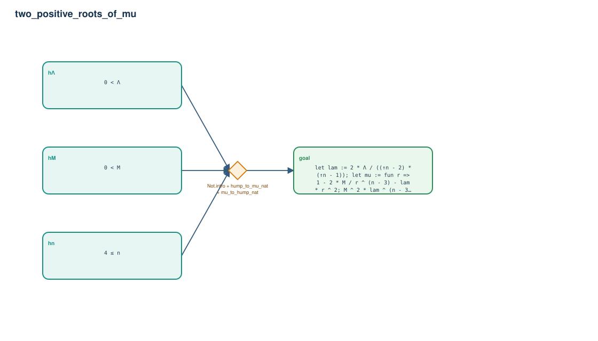

# two_positive_roots_of_mu

- Problem index: `292`
- arXiv source: `1502.03179`
- Selected nodes / hyperedges: **4 / 1**
- Selected depth: **1**
- Retrieval events matched: **0 / 17**
- Incomplete target InfoTree snapshots audited/excluded: **16**
- Validation: original proof re-elaborated; every edge witness kernel-checked in its Lean local context; selected topology compiled as a separate Lean theorem.
- Axioms: `Classical.choice, Quot.sound, propext`
- Concrete certificate: [semantic_graph_certificate.lean](semantic_graph_certificate.lean) embeds the accepted proof and checks every selected raw witness, premise list, and conclusion against this graph.

## Hyperedges

| Edge | Premises | Conclusion | Rule | Retrieval |
|---|---|---|---|---|
| `h_goal` | hn, hM, hΛ | goal | `Not.intro + hump_to_mu_nat + mu_to_hump_nat` | — |
