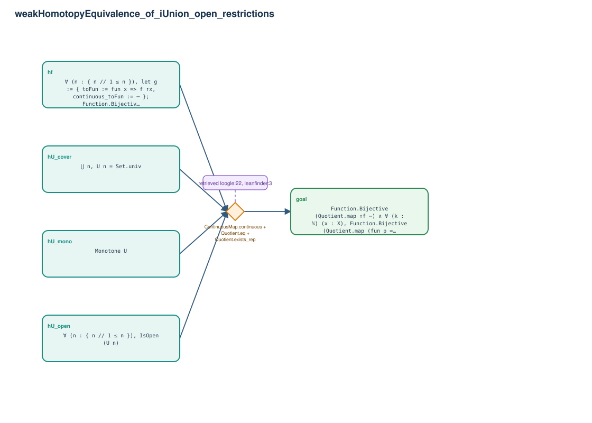

# weakHomotopyEquivalence_of_iUnion_open_restrictions

- Problem index: `367`
- arXiv source: `1307.0322`
- Selected nodes / hyperedges: **5 / 1**
- Selected depth: **1**
- Retrieval events matched: **4 / 25**
- Incomplete target InfoTree snapshots audited/excluded: **0**
- Validation: original proof re-elaborated; every edge witness kernel-checked in its Lean local context; selected topology compiled as a separate Lean theorem.
- Axioms: `Classical.choice, Quot.sound, propext`
- Concrete certificate: [semantic_graph_certificate.lean](semantic_graph_certificate.lean) embeds the accepted proof and checks every selected raw witness, premise list, and conclusion against this graph.

## Hyperedges

| Edge | Premises | Conclusion | Rule | Retrieval |
|---|---|---|---|---|
| `h_goal` | hU_open, hU_mono, hU_cover, hf | goal | `ContinuousMap.continuous + Quotient.eq + Quotient.exists_rep` | loogle:22, leanfinder:3, loogle:27, leanfinder:29 |
