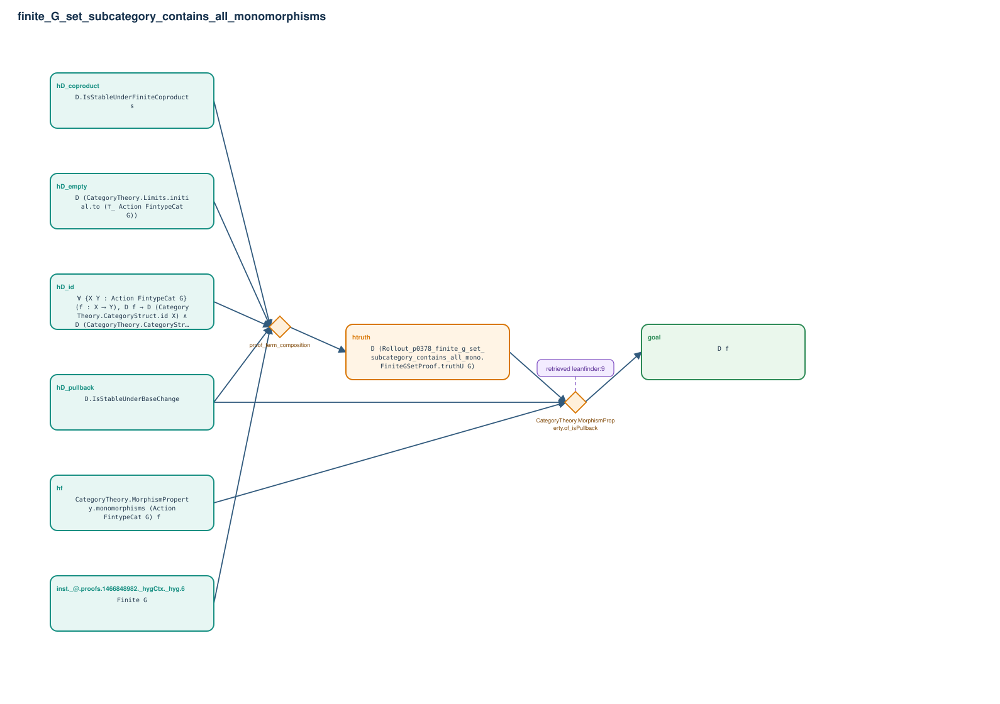

# finite_G_set_subcategory_contains_all_monomorphisms

- Problem index: `378`
- arXiv source: `1603.03292`
- Selected nodes / hyperedges: **8 / 2**
- Selected depth: **2**
- Retrieval events matched: **1 / 73**
- Incomplete target InfoTree snapshots audited/excluded: **0**
- Validation: original proof re-elaborated; every edge witness kernel-checked in its Lean local context; selected topology compiled as a separate Lean theorem.
- Axioms: `Classical.choice, Quot.sound, propext`
- Concrete certificate: [semantic_graph_certificate.lean](semantic_graph_certificate.lean) embeds the accepted proof and checks every selected raw witness, premise list, and conclusion against this graph.

## Hyperedges

| Edge | Premises | Conclusion | Rule | Retrieval |
|---|---|---|---|---|
| `h_001_htruth` | inst._@.proofs.1466848982._hygCtx._hyg.6, hD_id, hD_pullback, hD_coproduct, hD_empty | htruth | `proof_term_composition` | — |
| `h_goal` | hD_pullback, hf, htruth | goal | `CategoryTheory.MorphismProperty.of_isPullback` | leanfinder:9 |
