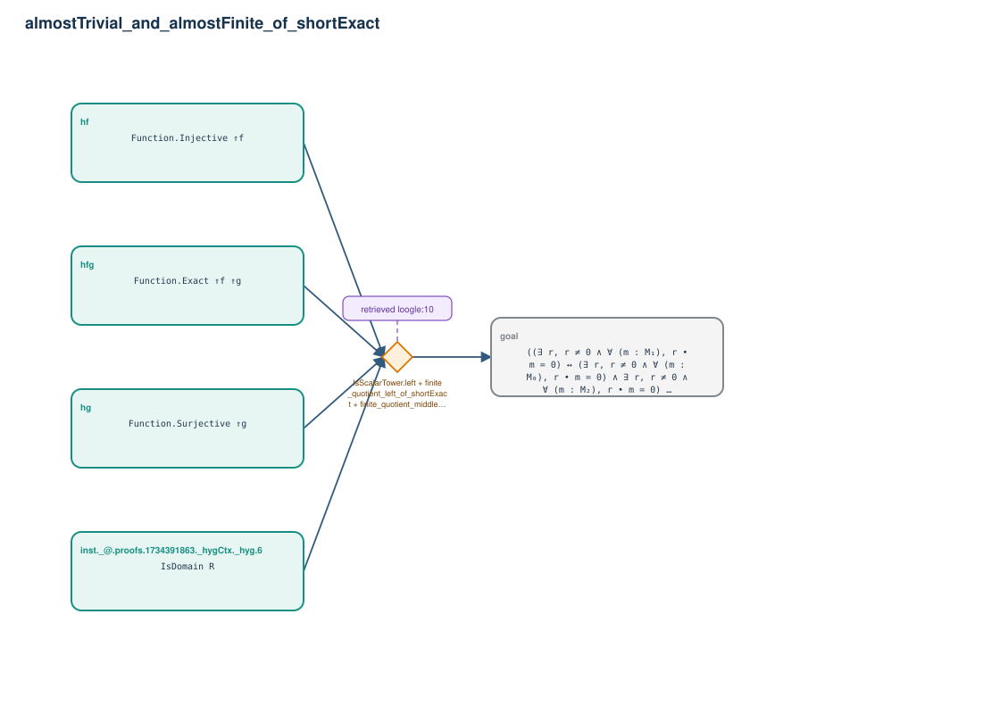

# almostTrivial_and_almostFinite_of_shortExact

- Problem index: `412`
- arXiv source: `math_0302116`
- Selected nodes / hyperedges: **5 / 1**
- Selected depth: **1**
- Retrieval events matched: **1 / 56**
- Incomplete target InfoTree snapshots audited/excluded: **0**
- Validation: original proof re-elaborated; every edge witness kernel-checked in its Lean local context; selected topology compiled as a separate Lean theorem.
- Axioms: `Classical.choice, Quot.sound, propext`
- Concrete certificate: [semantic_graph_certificate.lean](semantic_graph_certificate.lean) embeds the accepted proof and checks every selected raw witness, premise list, and conclusion against this graph.

## Hyperedges

| Edge | Premises | Conclusion | Rule | Retrieval |
|---|---|---|---|---|
| `h_goal` | inst._@.proofs.1734391863._hygCtx._hyg.6, hf, hfg, hg | goal | `IsScalarTower.left + finite_quotient_left_of_shortExact + finite_quotient_middle_of_shortExact` | loogle:10 |
