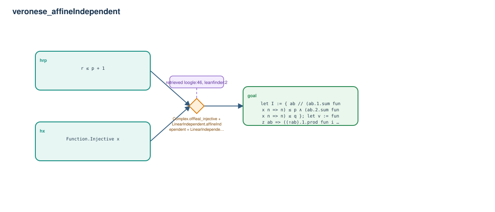

# veronese_affineIndependent

- Problem index: `414`
- arXiv source: `math_0307103`
- Selected nodes / hyperedges: **3 / 1**
- Selected depth: **1**
- Retrieval events matched: **4 / 31**
- Incomplete target InfoTree snapshots audited/excluded: **0**
- Validation: original proof re-elaborated; every edge witness kernel-checked in its Lean local context; selected topology compiled as a separate Lean theorem.
- Axioms: `Classical.choice, Quot.sound, propext`
- Concrete certificate: [semantic_graph_certificate.lean](semantic_graph_certificate.lean) embeds the accepted proof and checks every selected raw witness, premise list, and conclusion against this graph.

## Hyperedges

| Edge | Premises | Conclusion | Rule | Retrieval |
|---|---|---|---|---|
| `h_goal` | hrp, hx | goal | `Complex.ofReal_injective + LinearIndependent.affineIndependent + LinearIndependent.restrict_scalars` | loogle:46, leanfinder:2, loogle:3, leanfinder:4 |
