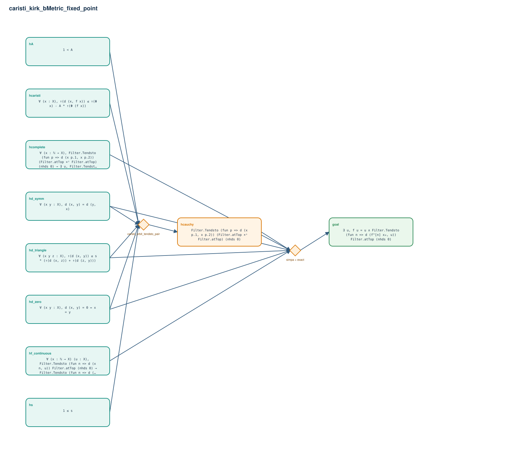

# caristi_kirk_bMetric_fixed_point

- Problem index: `489`
- arXiv source: `1512.03968`
- Selected nodes / hyperedges: **10 / 2**
- Selected depth: **2**
- Retrieval events matched: **0 / 37**
- Incomplete target InfoTree snapshots audited/excluded: **0**
- Validation: original proof re-elaborated; every edge witness kernel-checked in its Lean local context; selected topology compiled as a separate Lean theorem.
- Axioms: `Classical.choice, Quot.sound, propext`
- Concrete certificate: [semantic_graph_certificate.lean](semantic_graph_certificate.lean) embeds the accepted proof and checks every selected raw witness, premise list, and conclusion against this graph.

## Hyperedges

| Edge | Premises | Conclusion | Rule | Retrieval |
|---|---|---|---|---|
| `h_001_hcauchy` | hs, hd_zero, hd_symm, hd_triangle, hA, hcaristi | hcauchy | `caristi_orbit_tendsto_pair` | — |
| `h_goal` | hd_zero, hd_symm, hd_triangle, hcomplete, hf_continuous, hcauchy | goal | `simpa + exact` | — |
