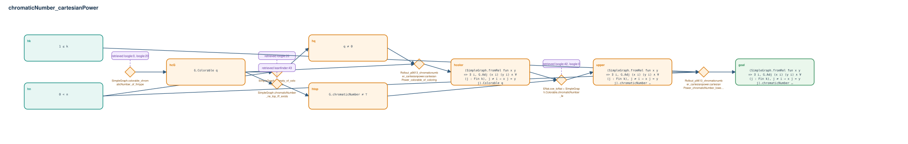

# chromaticNumber_cartesianPower

- Problem index: `613`
- arXiv source: `1310.2268`
- Selected nodes / hyperedges: **8 / 6**
- Selected depth: **5**
- Retrieval events matched: **5 / 35**
- Incomplete target InfoTree snapshots audited/excluded: **0**
- Validation: original proof re-elaborated; every edge witness kernel-checked in its Lean local context; selected topology compiled as a separate Lean theorem.
- Axioms: `Classical.choice, Quot.sound, propext`
- Concrete certificate: [semantic_graph_certificate.lean](semantic_graph_certificate.lean) embeds the accepted proof and checks every selected raw witness, premise list, and conclusion against this graph.

## Hyperedges

| Edge | Premises | Conclusion | Rule | Retrieval |
|---|---|---|---|---|
| `h_001_hcg` | ∅ | hcG | `SimpleGraph.colorable_chromaticNumber_of_fintype` | loogle:0, loogle:20 |
| `h_002_hq` | hn, hcG | hq | `SimpleGraph.isEmpty_of_colorable_zero` | loogle:20 |
| `h_003_hcolor` | hcG, hq | hcolor | `Rollout_p0613_chromaticnumber_cartesianpower.cartesianPower_colorable_of_coloring` | — |
| `h_004_htop` | hcG | htop | `SimpleGraph.chromaticNumber_ne_top_iff_exists` | leanfinder:43 |
| `h_005_upper` | hcolor, htop | upper | `ENat.coe_toNat + SimpleGraph.Colorable.chromaticNumber_le` | loogle:42, loogle:0, leanfinder:1 |
| `h_goal` | hn, hk, upper | goal | `Rollout_p0613_chromaticnumber_cartesianpower.cartesianPower_chromaticNumber_lower + le_antisymm` | — |
