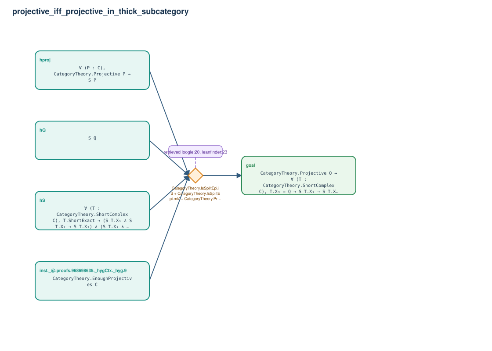

# projective_iff_projective_in_thick_subcategory

- Problem index: `786`
- arXiv source: `1602.07328`
- Selected nodes / hyperedges: **5 / 1**
- Selected depth: **1**
- Retrieval events matched: **11 / 24**
- Incomplete target InfoTree snapshots audited/excluded: **0**
- Validation: original proof re-elaborated; every edge witness kernel-checked in its Lean local context; selected topology compiled as a separate Lean theorem.
- Axioms: `Classical.choice, Quot.sound, propext`
- Concrete certificate: [semantic_graph_certificate.lean](semantic_graph_certificate.lean) embeds the accepted proof and checks every selected raw witness, premise list, and conclusion against this graph.

## Hyperedges

| Edge | Premises | Conclusion | Rule | Retrieval |
|---|---|---|---|---|
| `h_goal` | inst._@.proofs.968698635._hygCtx._hyg.9, hS, hproj, hQ | goal | `CategoryTheory.IsSplitEpi.id + CategoryTheory.IsSplitEpi.mk' + CategoryTheory.Projective.factorThru_comp` | loogle:20, leanfinder:23, loogle:13, loogle:14, loogle:9, loogle:12, leanfinder:16, leanfinder:1, loogle:3, leanfinder:5, leanfinder:17 |
