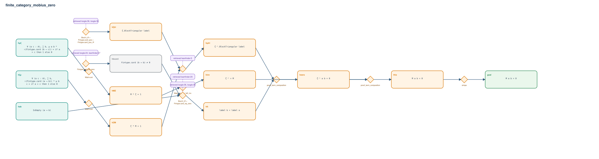

# finite_category_mobius_zero

- Problem index: `824`
- arXiv source: `math_0610260`
- Selected nodes / hyperedges: **13 / 10**
- Selected depth: **5**
- Retrieval events matched: **11 / 36**
- Incomplete target InfoTree snapshots audited/excluded: **0**
- Validation: original proof re-elaborated; every edge witness kernel-checked in its Lean local context; selected topology compiled as a separate Lean theorem.
- Axioms: `Classical.choice, Quot.sound, propext`
- Concrete certificate: [semantic_graph_certificate.lean](semantic_graph_certificate.lean) embeds the accepted proof and checks every selected raw witness, premise list, and conclusion against this graph.

## Hyperedges

| Edge | Premises | Conclusion | Rule | Retrieval |
|---|---|---|---|---|
| `h_001_hmz` | hμζ | hMZ | `Matrix.ext` | — |
| `h_002_hzm` | hζμ | hZM | `Matrix.ext` | — |
| `h_003_h_tri` | ∅ | hζtri | `Bool.lt_iff + Fintype.card_pos + Fintype.card_pos_iff` | loogle:36, loogle:38, loogle:25, loogle:26, leanfinder:27, loogle:29, loogle:32 |
| `h_004_h_tri` | hZM, hζtri | hμtri | `Matrix.blockTriangular_inv_of_blockTriangular` | leanfinder:5 |
| `h_005_hinv` | hMZ | hinv | `Matrix.inv_eq_left_inv` | leanfinder:20 |
| `h_006_hbcard` | ∅ | hbcard | `Fintype.card_ne_zero` | loogle:24, leanfinder:27 |
| `h_007_hlt` | hab, hbcard | hlt | `Bool.lt_iff + Fintype.card_eq_zero` | loogle:36, loogle:38, loogle:30 |
| `h_008_hzero` | hμtri, hlt | hzero | `proof_term_composition` | — |
| `h_009_this` | hinv, hzero | this | `proof_term_composition` | — |
| `h_goal` | this | goal | `simpa` | — |
