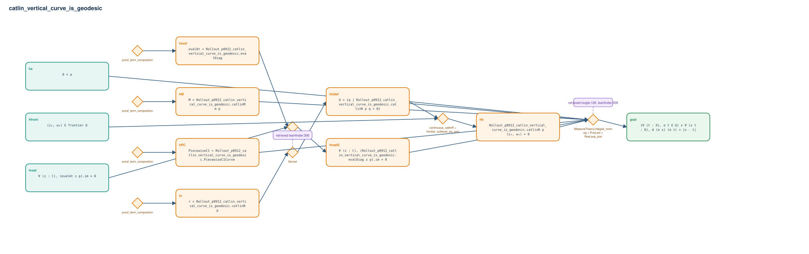

# catlin_vertical_curve_is_geodesic

- Problem index: `912`
- arXiv source: `2004.09232`
- Selected nodes / hyperedges: **11 / 8**
- Selected depth: **4**
- Retrieval events matched: **2 / 230**
- Incomplete target InfoTree snapshots audited/excluded: **0**
- Validation: original proof re-elaborated; every edge witness kernel-checked in its Lean local context; selected topology compiled as a separate Lean theorem.
- Axioms: `Classical.choice, Quot.sound, propext`
- Concrete certificate: [semantic_graph_certificate.lean](semantic_graph_certificate.lean) embeds the accepted proof and checks every selected raw witness, premise list, and conclusion against this graph.

## Hyperedges

| Edge | Premises | Conclusion | Rule | Retrieval |
|---|---|---|---|---|
| `h_001_heval` | ∅ | heval | `proof_term_composition` | — |
| `h_006_hr` | ∅ | hr | `proof_term_composition` | — |
| `h_007_hm` | ∅ | hM | `proof_term_composition` | — |
| `h_008_hpc` | ∅ | hPC | `proof_term_composition` | — |
| `h_009_hrealg` | hreal, heval | hrealG | `exact + rw` | — |
| `h_010_h_def` | hr | hΩdef | `Set.ext` | leanfinder:306 |
| `h_011_hb` | hfront, hΩdef | hb | `continuous_catlinR + frontier_sublevel_eq_zero` | — |
| `h_goal` | ha, hM, hPC, hrealG, hΩdef, hb | goal | `MeasureTheory.integral_nonneg + Prod.ext + Real.exp_pos` | loogle:126, leanfinder:306 |
