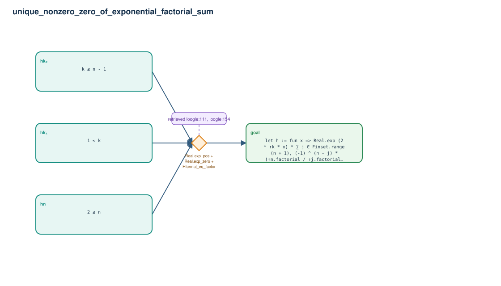

# unique_nonzero_zero_of_exponential_factorial_sum

- Problem index: `968`
- arXiv source: `1203.4794`
- Selected nodes / hyperedges: **4 / 1**
- Selected depth: **1**
- Retrieval events matched: **3 / 75**
- Incomplete target InfoTree snapshots audited/excluded: **0**
- Validation: original proof re-elaborated; every edge witness kernel-checked in its Lean local context; selected topology compiled as a separate Lean theorem.
- Axioms: `Classical.choice, Quot.sound, propext`
- Concrete certificate: [semantic_graph_certificate.lean](semantic_graph_certificate.lean) embeds the accepted proof and checks every selected raw witness, premise list, and conclusion against this graph.

## Hyperedges

| Edge | Premises | Conclusion | Rule | Retrieval |
|---|---|---|---|---|
| `h_goal` | hn, hk₁, hk₂ | goal | `Real.exp_pos + Real.exp_zero + Hformal_eq_factor` | loogle:111, loogle:154, loogle:155 |
