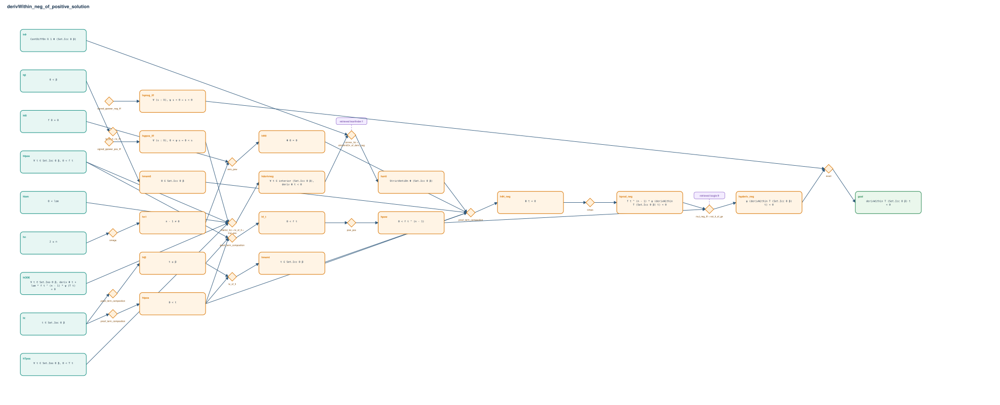

# derivWithin_neg_of_positive_solution

- Problem index: `971`
- arXiv source: `1211.6416`
- Selected nodes / hyperedges: **25 / 16**
- Selected depth: **7**
- Retrieval events matched: **2 / 10**
- Incomplete target InfoTree snapshots audited/excluded: **0**
- Validation: original proof re-elaborated; every edge witness kernel-checked in its Lean local context; selected topology compiled as a separate Lean theorem.
- Axioms: `Classical.choice, Quot.sound, propext`
- Concrete certificate: [semantic_graph_certificate.lean](semantic_graph_certificate.lean) embeds the accepted proof and checks every selected raw witness, premise list, and conclusion against this graph.

## Hyperedges

| Edge | Premises | Conclusion | Rule | Retrieval |
|---|---|---|---|---|
| `h_001_h_neg_iff` | ∅ | hψneg_iff | `signed_ppower_neg_iff` | — |
| `h_002_h_pos_iff` | ∅ | hψpos_iff | `signed_ppower_pos_iff` | — |
| `h_003_hderivneg` | hlam, hfpos, hODE, hTpos, hψpos_iff | hderivneg | `interior_Icc + le_of_lt + mul_pos` | — |
| `h_004_hanti` | hΦ, hderivneg | hanti | `convex_Icc + strictAntiOn_of_deriv_neg` | leanfinder:1 |
| `h_005_hn1` | hn | hn1 | `omega` | — |
| `h_006_h_0` | hf0, hn1 | hΦ0 | `zero_pow` | — |
| `h_007_htpos` | ht | htpos | `proof_term_composition` | — |
| `h_008_ht` | ht | htβ | `proof_term_composition` | — |
| `h_009_hmem0` | hβ | hmem0 | `le_of_lt + le_rfl` | — |
| `h_010_hmemt` | htpos, htβ | hmemt | `le_of_lt` | — |
| `h_011_h_t_neg` | hanti, hΦ0, htpos, hmem0, hmemt | hΦt_neg | `proof_term_composition` | — |
| `h_012_hprod_neg` | hΦt_neg | hprod_neg | `simpa` | — |
| `h_013_hf_t` | hfpos, htpos, htβ | hf_t | `proof_term_composition` | — |
| `h_014_hpow` | hf_t | hpow | `pow_pos` | — |
| `h_015_h_deriv_neg` | hprod_neg, hpow | hψderiv_neg | `mul_neg_iff + not_lt_of_ge` | loogle:9 |
| `h_goal` | hψneg_iff, hψderiv_neg | goal | `exact` | — |
