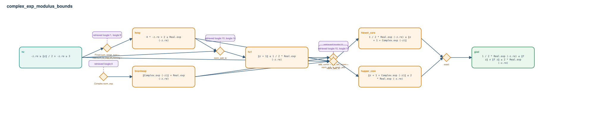

# complex_exp_modulus_bounds

- Problem index: `1067`
- arXiv source: `1510.07449`
- Selected nodes / hyperedges: **7 / 6**
- Selected depth: **4**
- Retrieval events matched: **6 / 16**
- Incomplete target InfoTree snapshots audited/excluded: **0**
- Validation: original proof re-elaborated; every edge witness kernel-checked in its Lean local context; selected topology compiled as a separate Lean theorem.
- Axioms: `Classical.choice, Quot.sound, propext`
- Concrete certificate: [semantic_graph_certificate.lean](semantic_graph_certificate.lean) embeds the accepted proof and checks every selected raw witness, premise list, and conclusion against this graph.

## Hyperedges

| Edge | Premises | Conclusion | Rule | Retrieval |
|---|---|---|---|---|
| `h_003_hexp` | hz | hexp | `Finset.sum_range_succ + Real.sum_le_exp_of_nonneg + sq_nonneg` | loogle:1, loogle:9 |
| `h_004_hz1` | hz, hexp | hz1 | `norm_add_le` | loogle:10, loogle:14 |
| `h_005_hnormexp` | ∅ | hnormexp | `Complex.norm_exp` | loogle:4 |
| `h_006_hlower_core` | hz1, hnormexp | hlower_core | `add_comm + add_left_comm + norm_sub_le_norm_add` | loogle:11 |
| `h_007_hupper_core` | hz, hexp, hz1, hnormexp | hupper_core | `norm_add_le` | loogle:10, loogle:14 |
| `h_goal` | hlower_core, hupper_core | goal | `exact` | — |
