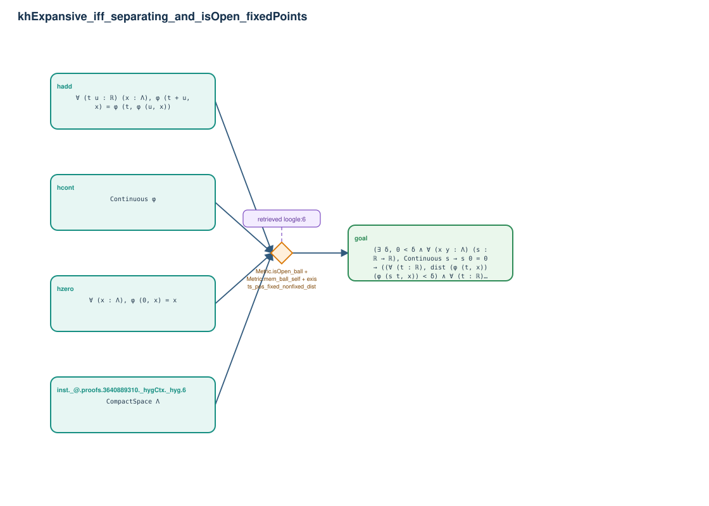

# khExpansive_iff_separating_and_isOpen_fixedPoints

- Problem index: `1078`
- arXiv source: `1801.08461`
- Selected nodes / hyperedges: **5 / 1**
- Selected depth: **1**
- Retrieval events matched: **1 / 39**
- Incomplete target InfoTree snapshots audited/excluded: **0**
- Validation: original proof re-elaborated; every edge witness kernel-checked in its Lean local context; selected topology compiled as a separate Lean theorem.
- Axioms: `Classical.choice, Quot.sound, propext`
- Concrete certificate: [semantic_graph_certificate.lean](semantic_graph_certificate.lean) embeds the accepted proof and checks every selected raw witness, premise list, and conclusion against this graph.

## Hyperedges

| Edge | Premises | Conclusion | Rule | Retrieval |
|---|---|---|---|---|
| `h_goal` | inst._@.proofs.3640889310._hygCtx._hyg.6, hcont, hzero, hadd | goal | `Metric.isOpen_ball + Metric.mem_ball_self + exists_pos_fixed_nonfixed_dist` | loogle:6 |
