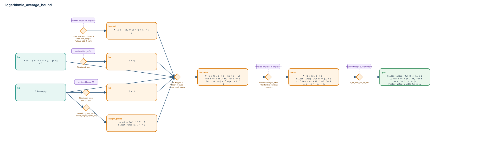

# logarithmic_average_bound

- Problem index: `1089`
- arXiv source: `2002.03498`
- Selected nodes / hyperedges: **9 / 7**
- Selected depth: **4**
- Retrieval events matched: **13 / 157**
- Incomplete target InfoTree snapshots audited/excluded: **0**
- Validation: original proof re-elaborated; every edge witness kernel-checked in its Lean local context; selected topology compiled as a separate Lean theorem.
- Axioms: `Classical.choice, Quot.sound, propext`
- Concrete certificate: [semantic_graph_certificate.lean](semantic_graph_certificate.lean) embeds the accepted proof and checks every selected raw witness, premise list, and conclusion against this graph.

## Hyperedges

| Edge | Premises | Conclusion | Rule | Retrieval |
|---|---|---|---|---|
| `h_001_hq` | ∅ | hq | `Finset.prod_pos` | loogle:51 |
| `h_002_hs` | hB | hS | `Finset.sum_pos + one_div_pos` | loogle:52 |
| `h_005_hperiod` | ∅ | hperiod | `Finset.dvd_prod_of_mem + Finset.sum_congr + Nat.dvd_add_iff_right` | loogle:50, loogle:67, loogle:130 |
| `h_006_htarget_period` | hB | htarget_period | `nested_log_avg_gcd + period_weight_square_avg` | — |
| `h_007_hboundn` | hB, ha, hq, hS, hperiod, htarget_period | hboundN | `Nat.mul_pos + Nat.zero_lt_succ + global_local_approx` | — |
| `h_008_hmain` | hboundN | hmain | `Filter.Eventually.of_forall + Filter.Tendsto.eventually_lt_const + Filter.eventually_ge_atTop` | loogle:242, loogle:237, loogle:228, loogle:229, leanfinder:233, loogle:0 |
| `h_goal` | hmain | goal | `le_of_forall_pos_le_add` | loogle:6, leanfinder:8 |
