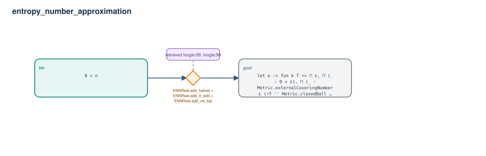

# entropy_number_approximation

- Problem index: `1136`
- arXiv source: `1002.1377`
- Selected nodes / hyperedges: **2 / 1**
- Selected depth: **1**
- Retrieval events matched: **13 / 114**
- Incomplete target InfoTree snapshots audited/excluded: **0**
- Validation: original proof re-elaborated; every edge witness kernel-checked in its Lean local context; selected topology compiled as a separate Lean theorem.
- Axioms: `Classical.choice, Quot.sound, propext`
- Concrete certificate: [semantic_graph_certificate.lean](semantic_graph_certificate.lean) embeds the accepted proof and checks every selected raw witness, premise list, and conclusion against this graph.

## Hyperedges

| Edge | Premises | Conclusion | Rule | Retrieval |
|---|---|---|---|---|
| `h_goal` | hn | goal | `ENNReal.add_halves + ENNReal.add_lt_add + ENNReal.add_ne_top` | loogle:99, loogle:98, loogle:122, loogle:96, loogle:92, loogle:93, loogle:87, loogle:86, loogle:77, loogle:70, loogle:94, loogle:116, loogle:68 |
