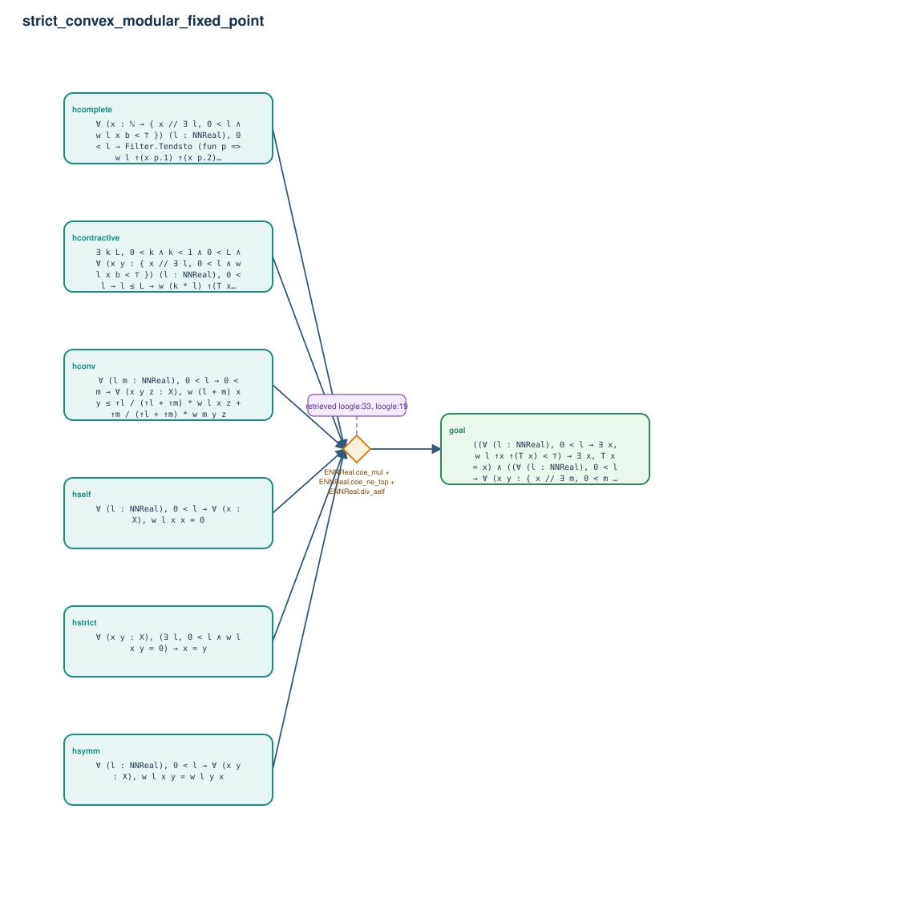

# strict_convex_modular_fixed_point

- Problem index: `1151`
- arXiv source: `1112.5561`
- Selected nodes / hyperedges: **7 / 1**
- Selected depth: **1**
- Retrieval events matched: **3 / 53**
- Incomplete target InfoTree snapshots audited/excluded: **0**
- Validation: original proof re-elaborated; every edge witness kernel-checked in its Lean local context; selected topology compiled as a separate Lean theorem.
- Axioms: `Classical.choice, Quot.sound, propext`
- Concrete certificate: [semantic_graph_certificate.lean](semantic_graph_certificate.lean) embeds the accepted proof and checks every selected raw witness, premise list, and conclusion against this graph.

## Hyperedges

| Edge | Premises | Conclusion | Rule | Retrieval |
|---|---|---|---|---|
| `h_goal` | hself, hsymm, hstrict, hconv, hcomplete, hcontractive | goal | `ENNReal.coe_mul + ENNReal.coe_ne_top + ENNReal.div_self` | loogle:33, loogle:19, loogle:28 |
