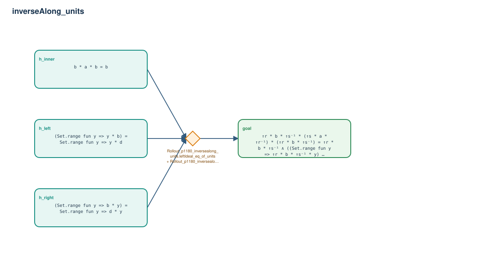

# inverseAlong_units

- Problem index: `1180`
- arXiv source: `1509.04251`
- Selected nodes / hyperedges: **4 / 1**
- Selected depth: **1**
- Retrieval events matched: **0 / 1**
- Incomplete target InfoTree snapshots audited/excluded: **0**
- Validation: original proof re-elaborated; every edge witness kernel-checked in its Lean local context; selected topology compiled as a separate Lean theorem.
- Axioms: `Quot.sound, propext`
- Concrete certificate: [semantic_graph_certificate.lean](semantic_graph_certificate.lean) embeds the accepted proof and checks every selected raw witness, premise list, and conclusion against this graph.

## Hyperedges

| Edge | Premises | Conclusion | Rule | Retrieval |
|---|---|---|---|---|
| `h_goal` | h_inner, h_right, h_left | goal | `Rollout_p1180_inversealong_units.leftIdeal_eq_of_units + Rollout_p1180_inversealong_units.rightIdeal_eq_of_units + mul_assoc` | — |
