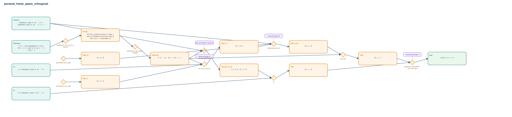

# parseval_frame_spans_orthogonal

- Problem index: `1193`
- arXiv source: `1701.08014`
- Selected nodes / hyperedges: **14 / 10**
- Selected depth: **6**
- Retrieval events matched: **4 / 51**
- Incomplete target InfoTree snapshots audited/excluded: **0**
- Validation: original proof re-elaborated; every edge witness kernel-checked in its Lean local context; selected topology compiled as a separate Lean theorem.
- Axioms: `Classical.choice, Quot.sound, propext`
- Concrete certificate: [semantic_graph_certificate.lean](semantic_graph_certificate.lean) embeds the accepted proof and checks every selected raw witness, premise list, and conclusion against this graph.

## Hyperedges

| Edge | Premises | Conclusion | Rule | Retrieval |
|---|---|---|---|---|
| `h_001_hframe` | hParseval | hframe | `partialFrame_univ_eq_id_of_parseval` | — |
| `h_002_hdecomp` | hframe | hdecomp | `partialFrame_add_compl + congrArg` | — |
| `h_003_hsi_zero_on_b` | hdisjoint, hdecomp | hSI_zero_on_B | `partialFrame_mem_span + Submodule.mem_bot + eq_sub_of_add_eq` | loogle:78, loogle:75, loogle:76 |
| `h_004_hsiu_a` | ∅ | hSIu_A | `partialFrame_mem_span` | — |
| `h_005_hscu_b` | ∅ | hSCu_B | `partialFrame_mem_span` | — |
| `h_006_hscu_a` | hdecomp, hu, hSIu_A | hSCu_A | `eq_sub_of_add_eq'` | loogle:75 |
| `h_007_hscu_zero` | hdisjoint, hSCu_B, hSCu_A | hSCu_zero | `Submodule.mem_bot` | loogle:78 |
| `h_008_hsiu` | hdecomp, hSCu_zero | hSIu | `add_zero` | — |
| `h_009_hsiv` | hSI_zero_on_B, hv | hSIv | `rw` | — |
| `h_goal` | hSIu, hSIv | goal | `partialFrame_isSymmetric + inner_zero_right` | leanfinder:7 |
