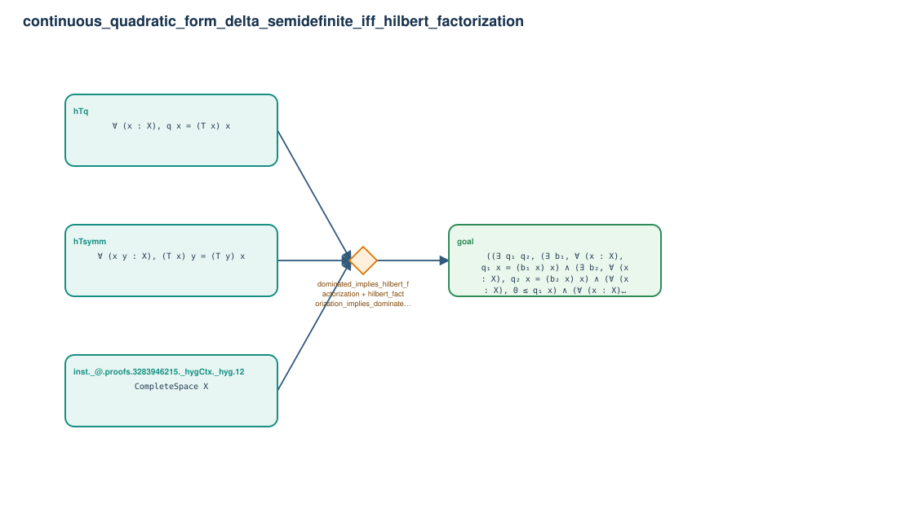

# continuous_quadratic_form_delta_semidefinite_iff_hilbert_factorization

- Problem index: `1226`
- arXiv source: `math_0605549`
- Selected nodes / hyperedges: **4 / 1**
- Selected depth: **1**
- Retrieval events matched: **0 / 118**
- Incomplete target InfoTree snapshots audited/excluded: **0**
- Validation: original proof re-elaborated; every edge witness kernel-checked in its Lean local context; selected topology compiled as a separate Lean theorem.
- Axioms: `Classical.choice, Quot.sound, propext`
- Concrete certificate: [semantic_graph_certificate.lean](semantic_graph_certificate.lean) embeds the accepted proof and checks every selected raw witness, premise list, and conclusion against this graph.

## Hyperedges

| Edge | Premises | Conclusion | Rule | Retrieval |
|---|---|---|---|---|
| `h_goal` | inst._@.proofs.3283946215._hygCtx._hyg.12, hTq, hTsymm | goal | `dominated_implies_hilbert_factorization + hilbert_factorization_implies_dominated + abs_le` | — |
