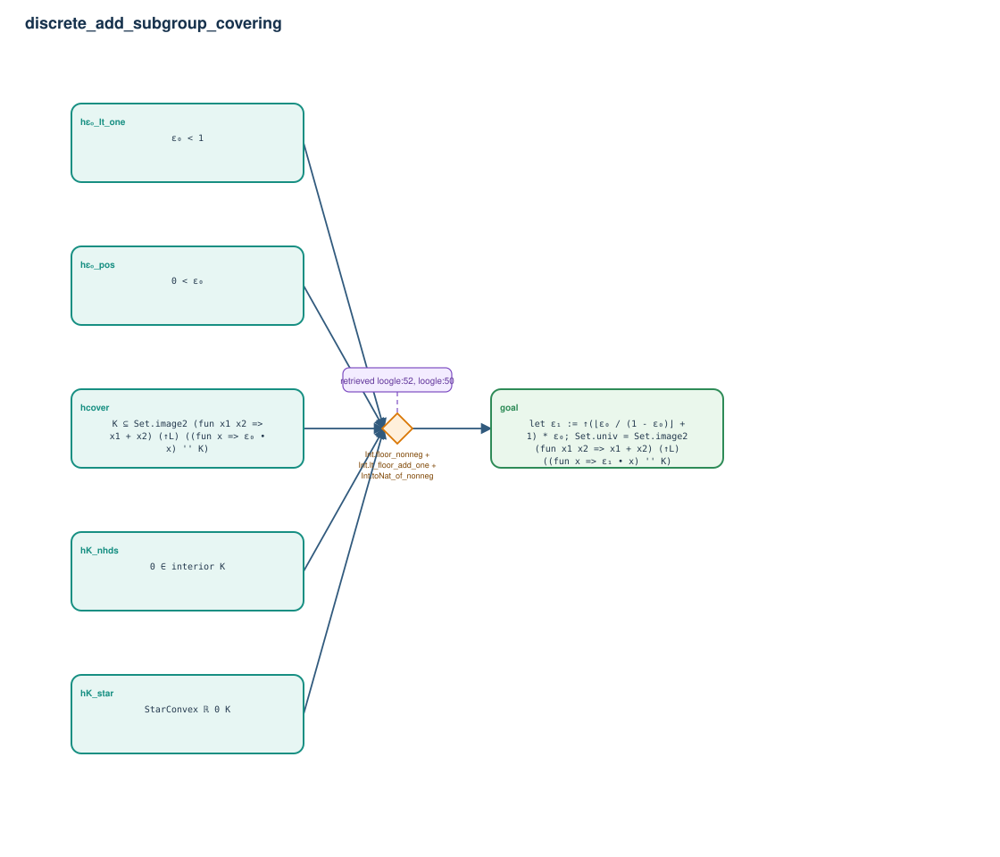

# discrete_add_subgroup_covering

- Problem index: `1227`
- arXiv source: `math_0606317`
- Selected nodes / hyperedges: **6 / 1**
- Selected depth: **1**
- Retrieval events matched: **3 / 50**
- Incomplete target InfoTree snapshots audited/excluded: **0**
- Validation: original proof re-elaborated; every edge witness kernel-checked in its Lean local context; selected topology compiled as a separate Lean theorem.
- Axioms: `Classical.choice, Quot.sound, propext`
- Concrete certificate: [semantic_graph_certificate.lean](semantic_graph_certificate.lean) embeds the accepted proof and checks every selected raw witness, premise list, and conclusion against this graph.

## Hyperedges

| Edge | Premises | Conclusion | Rule | Retrieval |
|---|---|---|---|---|
| `h_goal` | hK_nhds, hK_star, hε₀_pos, hε₀_lt_one, hcover | goal | `Int.floor_nonneg + Int.lt_floor_add_one + Int.toNat_of_nonneg` | loogle:52, loogle:50, loogle:55 |
