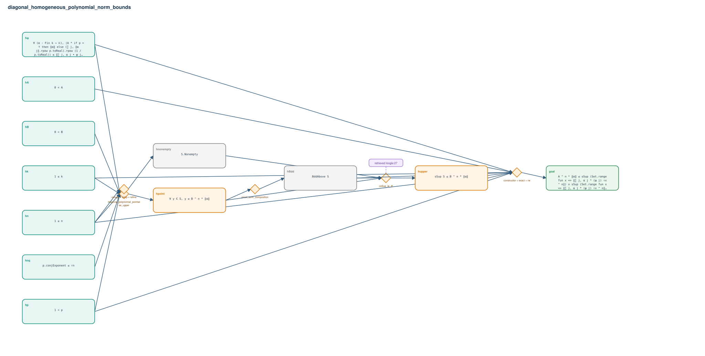

# diagonal_homogeneous_polynomial_norm_bounds

- Problem index: `1232`
- arXiv source: `math_9402203`
- Selected nodes / hyperedges: **12 / 5**
- Selected depth: **4**
- Retrieval events matched: **1 / 213**
- Incomplete target InfoTree snapshots audited/excluded: **0**
- Validation: original proof re-elaborated; every edge witness kernel-checked in its Lean local context; selected topology compiled as a separate Lean theorem.
- Axioms: `Classical.choice, Quot.sound, propext`
- Concrete certificate: [semantic_graph_certificate.lean](semantic_graph_certificate.lean) embeds the accepted proof and checks every selected raw witness, premise list, and conclusion against this graph.

## Hyperedges

| Edge | Premises | Conclusion | Rule | Retrieval |
|---|---|---|---|---|
| `h_001_hpoint` | hk, hB, hp, hφ, hn, hnq | hpoint | `diagonal_polynomial_pointwise_upper` | — |
| `h_002_hbdd` | hpoint | hBdd | `proof_term_composition` | — |
| `h_003_hnonempty` | hn | hnonempty | `omega + simp + refine` | — |
| `h_004_hupper` | hpoint, hBdd, hnonempty | hupper | `csSup_le_iff` | loogle:27 |
| `h_goal` | hk, hA, hp, hφ, hn, hBdd, hupper | goal | `constructor + exact + rw` | — |
