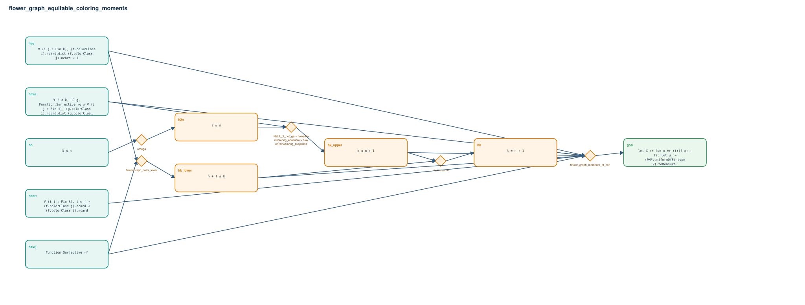

# flower_graph_equitable_coloring_moments

- Problem index: `1268`
- arXiv source: `1801.00468`
- Selected nodes / hyperedges: **10 / 5**
- Selected depth: **4**
- Retrieval events matched: **0 / 115**
- Incomplete target InfoTree snapshots audited/excluded: **0**
- Validation: original proof re-elaborated; every edge witness kernel-checked in its Lean local context; selected topology compiled as a separate Lean theorem.
- Axioms: `Classical.choice, Quot.sound, propext`
- Concrete certificate: [semantic_graph_certificate.lean](semantic_graph_certificate.lean) embeds the accepted proof and checks every selected raw witness, premise list, and conclusion against this graph.

## Hyperedges

| Edge | Premises | Conclusion | Rule | Retrieval |
|---|---|---|---|---|
| `h_001_h2n` | hn | h2n | `omega` | — |
| `h_002_hk_lower` | hsurj, heq | hk_lower | `flowerGraph_color_lower` | — |
| `h_003_hk_upper` | hmin, h2n | hk_upper | `Nat.lt_of_not_ge + flowerPairColoring_equitable + flowerPairColoring_surjective` | — |
| `h_004_hk` | hk_lower, hk_upper | hk | `le_antisymm` | — |
| `h_goal` | hsurj, heq, hmin, hsort, hk_lower, hk_upper, hk | goal | `flower_graph_moments_of_min` | — |
