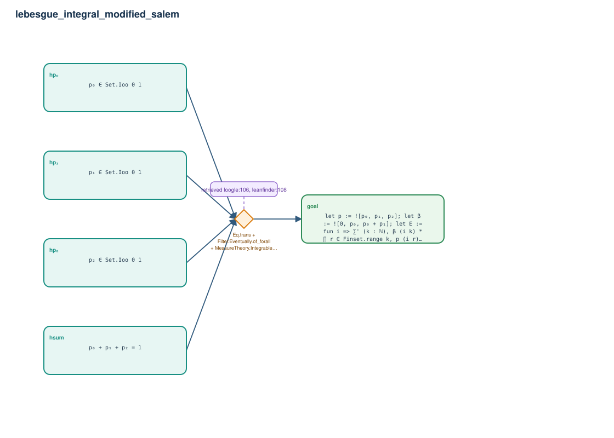

# lebesgue_integral_modified_salem

- Problem index: `1286`
- arXiv source: `2304.07776`
- Selected nodes / hyperedges: **5 / 1**
- Selected depth: **1**
- Retrieval events matched: **3 / 37**
- Incomplete target InfoTree snapshots audited/excluded: **0**
- Validation: original proof re-elaborated; every edge witness kernel-checked in its Lean local context; selected topology compiled as a separate Lean theorem.
- Axioms: `Classical.choice, Quot.sound, propext`
- Concrete certificate: [semantic_graph_certificate.lean](semantic_graph_certificate.lean) embeds the accepted proof and checks every selected raw witness, premise list, and conclusion against this graph.

## Hyperedges

| Edge | Premises | Conclusion | Rule | Retrieval |
|---|---|---|---|---|
| `h_goal` | hp₀, hp₁, hp₂, hsum | goal | `Eq.trans + Filter.Eventually.of_forall + MeasureTheory.IntegrableOn.congr_fun` | loogle:106, leanfinder:108, loogle:109 |
