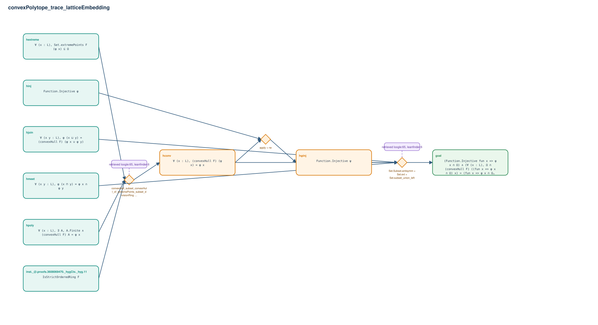

# convexPolytope_trace_latticeEmbedding

- Problem index: `1299`
- arXiv source: `math_0501324`
- Selected nodes / hyperedges: **9 / 3**
- Selected depth: **3**
- Retrieval events matched: **13 / 79**
- Incomplete target InfoTree snapshots audited/excluded: **0**
- Validation: original proof re-elaborated; every edge witness kernel-checked in its Lean local context; selected topology compiled as a separate Lean theorem.
- Axioms: `Classical.choice, Quot.sound, propext`
- Concrete certificate: [semantic_graph_certificate.lean](semantic_graph_certificate.lean) embeds the accepted proof and checks every selected raw witness, premise list, and conclusion against this graph.

## Hyperedges

| Edge | Premises | Conclusion | Rule | Retrieval |
|---|---|---|---|---|
| `h_001_hconv` | inst._@.proofs.3608069470._hygCtx._hyg.11, hpoly, hextreme | hconv | `convexHull_subset_convexHull_of_extremePoints_subset_divisionRing + Set.Subset.antisymm + convexHull_min` | loogle:65, leanfinder:6, leanfinder:12, leanfinder:46, leanfinder:47, leanfinder:48, leanfinder:66, leanfinder:67, leanfinder:70, leanfinder:11 |
| `h_002_h_inj` | hinj, hconv | hψinj | `apply + rw` | — |
| `h_goal` | hmeet, hjoin, hconv, hψinj | goal | `Set.Subset.antisymm + Set.ext + Set.subset_union_left` | loogle:65, leanfinder:6, leanfinder:12, leanfinder:46, leanfinder:47, leanfinder:48, leanfinder:66, leanfinder:67, leanfinder:70, leanfinder:58, leanfinder:59, leanfinder:60 |
