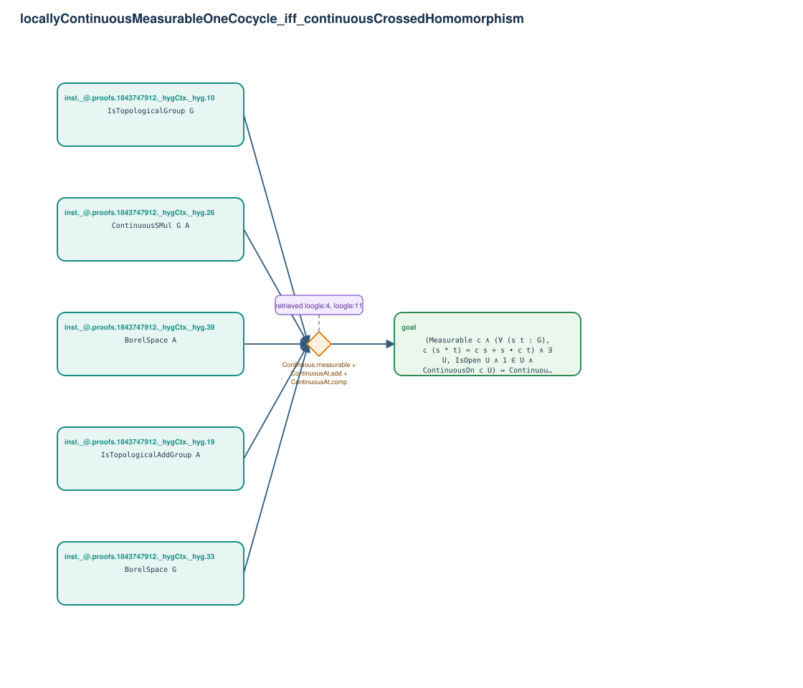

# locallyContinuousMeasurableOneCocycle_iff_continuousCrossedHomomorphism

- Problem index: `1355`
- arXiv source: `1009.4519`
- Selected nodes / hyperedges: **6 / 1**
- Selected depth: **1**
- Retrieval events matched: **8 / 18**
- Incomplete target InfoTree snapshots audited/excluded: **0**
- Validation: original proof re-elaborated; every edge witness kernel-checked in its Lean local context; selected topology compiled as a separate Lean theorem.
- Axioms: `Classical.choice, Quot.sound, propext`
- Concrete certificate: [semantic_graph_certificate.lean](semantic_graph_certificate.lean) embeds the accepted proof and checks every selected raw witness, premise list, and conclusion against this graph.

## Hyperedges

| Edge | Premises | Conclusion | Rule | Retrieval |
|---|---|---|---|---|
| `h_goal` | inst._@.proofs.1843747912._hygCtx._hyg.10, inst._@.proofs.1843747912._hygCtx._hyg.19, inst._@.proofs.1843747912._hygCtx._hyg.26, inst._@.proofs.1843747912._hygCtx._hyg.33, inst._@.proofs.1843747912._hygCtx._hyg.39 | goal | `Continuous.measurable + ContinuousAt.add + ContinuousAt.comp` | loogle:4, loogle:11, loogle:7, loogle:9, loogle:8, loogle:5, loogle:6, loogle:12 |
