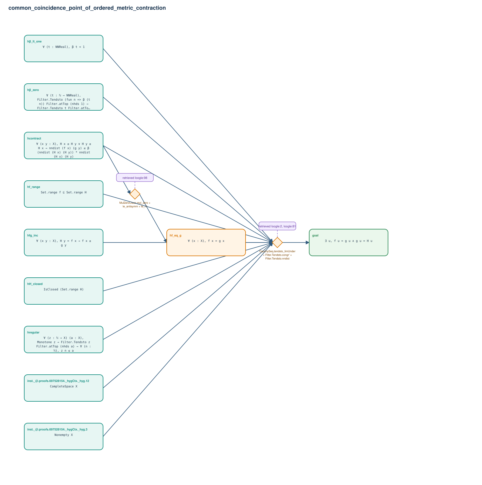

# common_coincidence_point_of_ordered_metric_contraction

- Problem index: `1362`
- arXiv source: `1102.5493`
- Selected nodes / hyperedges: **11 / 2**
- Selected depth: **2**
- Retrieval events matched: **10 / 81**
- Incomplete target InfoTree snapshots audited/excluded: **0**
- Validation: original proof re-elaborated; every edge witness kernel-checked in its Lean local context; selected topology compiled as a separate Lean theorem.
- Axioms: `Classical.choice, Quot.sound, propext`
- Concrete certificate: [semantic_graph_certificate.lean](semantic_graph_certificate.lean) embeds the accepted proof and checks every selected raw witness, premise list, and conclusion against this graph.

## Hyperedges

| Edge | Premises | Conclusion | Rule | Retrieval |
|---|---|---|---|---|
| `h_001_hf_eq_g` | hcontract | hf_eq_g | `MulZeroClass.mul_zero + le_antisymm + le_rfl` | loogle:98 |
| `h_goal` | inst._@.proofs.697528154._hygCtx._hyg.3, inst._@.proofs.697528154._hygCtx._hyg.12, hregular, hf_range, hH_closed, hfg_inc, hβ_lt_one, hβ_zero, hcontract, hf_eq_g | goal | `CauchySeq.tendsto_limUnder + Filter.Tendsto.congr' + Filter.Tendsto.nndist` | loogle:2, loogle:81, leanfinder:96, leanfinder:50, loogle:90, leanfinder:91, loogle:46, loogle:64, loogle:88 |
