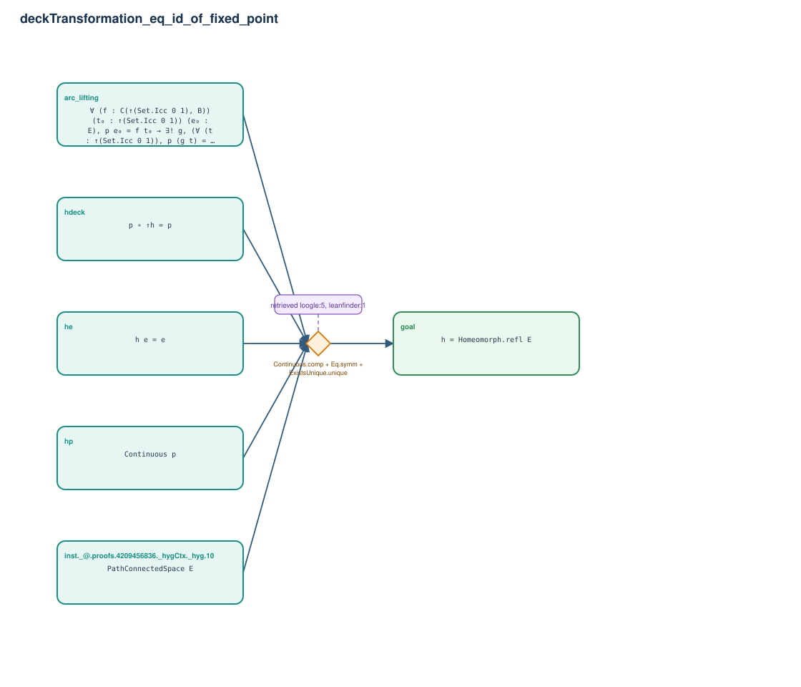

# deckTransformation_eq_id_of_fixed_point

- Problem index: `1371`
- arXiv source: `1108.3253`
- Selected nodes / hyperedges: **6 / 1**
- Selected depth: **1**
- Retrieval events matched: **10 / 16**
- Incomplete target InfoTree snapshots audited/excluded: **0**
- Validation: original proof re-elaborated; every edge witness kernel-checked in its Lean local context; selected topology compiled as a separate Lean theorem.
- Axioms: `Classical.choice, Quot.sound, propext`
- Concrete certificate: [semantic_graph_certificate.lean](semantic_graph_certificate.lean) embeds the accepted proof and checks every selected raw witness, premise list, and conclusion against this graph.

## Hyperedges

| Edge | Premises | Conclusion | Rule | Retrieval |
|---|---|---|---|---|
| `h_goal` | inst._@.proofs.4209456836._hygCtx._hyg.10, hp, arc_lifting, hdeck, he | goal | `Continuous.comp + Eq.symm + ExistsUnique.unique` | loogle:5, leanfinder:1, loogle:13, loogle:10, loogle:8, loogle:4, loogle:12, loogle:14, loogle:3, loogle:15 |
