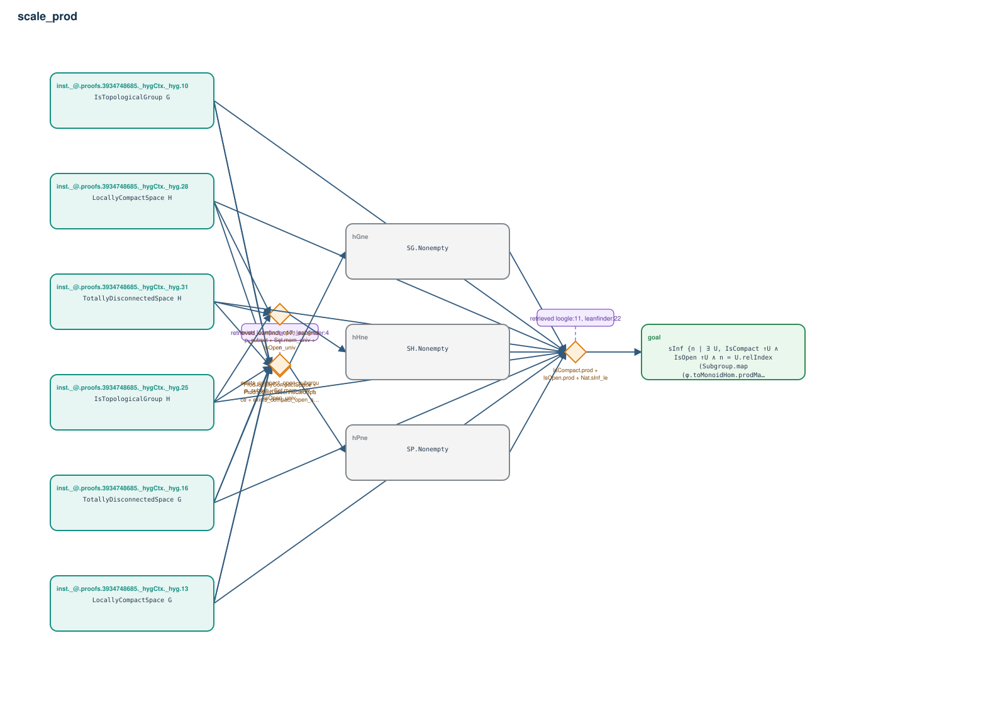

# scale_prod

- Problem index: `1384`
- arXiv source: `1210.1749`
- Selected nodes / hyperedges: **10 / 4**
- Selected depth: **2**
- Retrieval events matched: **10 / 96**
- Incomplete target InfoTree snapshots audited/excluded: **0**
- Validation: original proof re-elaborated; every edge witness kernel-checked in its Lean local context; selected topology compiled as a separate Lean theorem.
- Axioms: `Classical.choice, Quot.sound, propext`
- Concrete certificate: [semantic_graph_certificate.lean](semantic_graph_certificate.lean) embeds the accepted proof and checks every selected raw witness, premise list, and conclusion against this graph.

## Hyperedges

| Edge | Premises | Conclusion | Rule | Retrieval |
|---|---|---|---|---|
| `h_001_hpne` | inst._@.proofs.3934748685._hygCtx._hyg.10, inst._@.proofs.3934748685._hygCtx._hyg.13, inst._@.proofs.3934748685._hygCtx._hyg.16, inst._@.proofs.3934748685._hygCtx._hyg.25, inst._@.proofs.3934748685._hygCtx._hyg.28, inst._@.proofs.3934748685._hygCtx._hyg.31 | hPne | `Prod.locallyCompactSpace + Prod.totallyDisconnectedSpace + exists_compact_open_subgroup_subset` | leanfinder:17, leanfinder:4, leanfinder:13, leanfinder:112, leanfinder:14, leanfinder:88, leanfinder:25 |
| `h_002_hgne` | inst._@.proofs.3934748685._hygCtx._hyg.10, inst._@.proofs.3934748685._hygCtx._hyg.13, inst._@.proofs.3934748685._hygCtx._hyg.16 | hGne | `exists_compact_open_subgroup_subset + Set.mem_univ + isOpen_univ` | — |
| `h_003_hhne` | inst._@.proofs.3934748685._hygCtx._hyg.25, inst._@.proofs.3934748685._hygCtx._hyg.28, inst._@.proofs.3934748685._hygCtx._hyg.31 | hHne | `exists_compact_open_subgroup_subset + Set.mem_univ + isOpen_univ` | — |
| `h_goal` | inst._@.proofs.3934748685._hygCtx._hyg.10, inst._@.proofs.3934748685._hygCtx._hyg.13, inst._@.proofs.3934748685._hygCtx._hyg.16, inst._@.proofs.3934748685._hygCtx._hyg.25, inst._@.proofs.3934748685._hygCtx._hyg.28, inst._@.proofs.3934748685._hygCtx._hyg.31, hPne, hGne, hHne | goal | `IsCompact.prod + IsOpen.prod + Nat.sInf_le` | loogle:11, leanfinder:22, leanfinder:31 |
