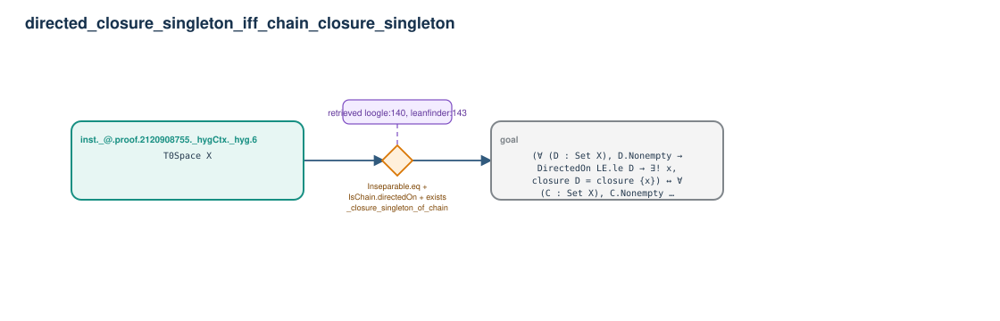

# directed_closure_singleton_iff_chain_closure_singleton

- Problem index: `1461`
- arXiv source: `2003.07737`
- Selected nodes / hyperedges: **2 / 1**
- Selected depth: **1**
- Retrieval events matched: **15 / 179**
- Incomplete target InfoTree snapshots audited/excluded: **0**
- Validation: original proof re-elaborated; every edge witness kernel-checked in its Lean local context; selected topology compiled as a separate Lean theorem.
- Axioms: `Classical.choice, Quot.sound, propext`
- Concrete certificate: [semantic_graph_certificate.lean](semantic_graph_certificate.lean) embeds the accepted proof and checks every selected raw witness, premise list, and conclusion against this graph.

## Hyperedges

| Edge | Premises | Conclusion | Rule | Retrieval |
|---|---|---|---|---|
| `h_goal` | inst._@.proof.2120908755._hygCtx._hyg.6 | goal | `Inseparable.eq + IsChain.directedOn + exists_closure_singleton_of_chain` | loogle:140, leanfinder:143, loogle:101, leanfinder:3, loogle:14, leanfinder:52, leanfinder:74, leanfinder:75, leanfinder:82, leanfinder:84, leanfinder:88, leanfinder:8, leanfinder:136, loogle:0, loogle:142 |
