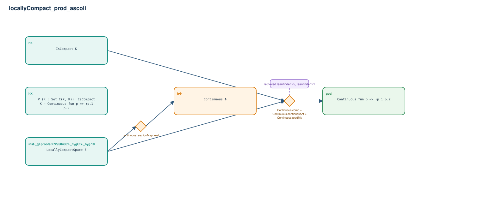

# locallyCompact_prod_ascoli

- Problem index: `1462`
- arXiv source: `2004.00075`
- Selected nodes / hyperedges: **5 / 2**
- Selected depth: **2**
- Retrieval events matched: **7 / 41**
- Incomplete target InfoTree snapshots audited/excluded: **0**
- Validation: original proof re-elaborated; every edge witness kernel-checked in its Lean local context; selected topology compiled as a separate Lean theorem.
- Axioms: `Classical.choice, Quot.sound, propext`
- Concrete certificate: [semantic_graph_certificate.lean](semantic_graph_certificate.lean) embeds the accepted proof and checks every selected raw witness, premise list, and conclusion against this graph.

## Hyperedges

| Edge | Premises | Conclusion | Rule | Retrieval |
|---|---|---|---|---|
| `h_001_h` | inst._@.proofs.2729584061._hygCtx._hyg.10 | hΦ | `continuous_sectionMap_real` | — |
| `h_goal` | inst._@.proofs.2729584061._hygCtx._hyg.10, hX, hK, hΦ | goal | `Continuous.comp + Continuous.continuousAt + Continuous.prodMk` | leanfinder:25, leanfinder:21, loogle:33, leanfinder:43, loogle:24, loogle:22, leanfinder:14 |
