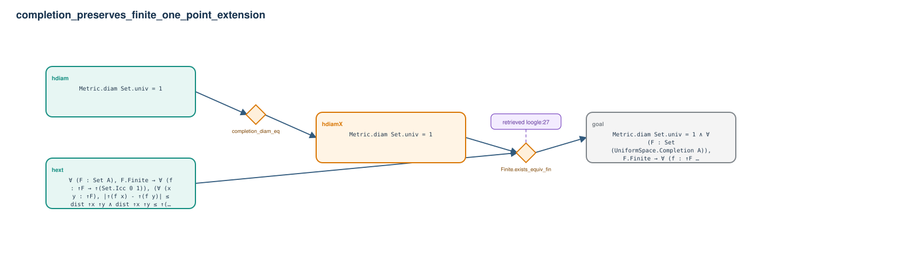

# completion_preserves_finite_one_point_extension

- Problem index: `1479`
- arXiv source: `math_0004119`
- Selected nodes / hyperedges: **4 / 2**
- Selected depth: **2**
- Retrieval events matched: **1 / 97**
- Incomplete target InfoTree snapshots audited/excluded: **0**
- Validation: original proof re-elaborated; every edge witness kernel-checked in its Lean local context; selected topology compiled as a separate Lean theorem.
- Axioms: `Classical.choice, Quot.sound, propext`
- Concrete certificate: [semantic_graph_certificate.lean](semantic_graph_certificate.lean) embeds the accepted proof and checks every selected raw witness, premise list, and conclusion against this graph.

## Hyperedges

| Edge | Premises | Conclusion | Rule | Retrieval |
|---|---|---|---|---|
| `h_001_hdiamx` | hdiam | hdiamX | `completion_diam_eq` | — |
| `h_goal` | hext, hdiamX | goal | `Finite.exists_equiv_fin` | loogle:27 |
