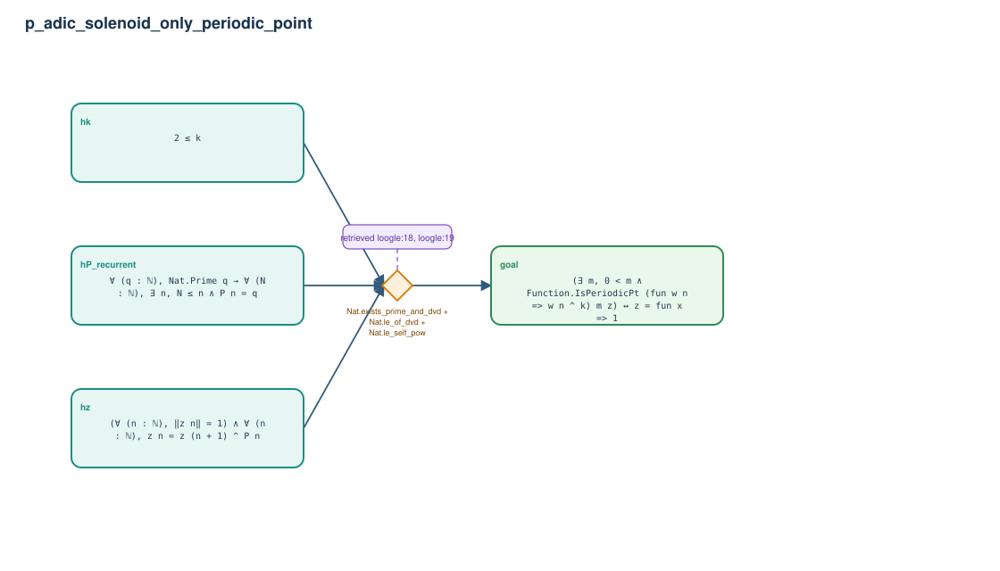

# p_adic_solenoid_only_periodic_point

- Problem index: `1494`
- arXiv source: `math_0312288`
- Selected nodes / hyperedges: **4 / 1**
- Selected depth: **1**
- Retrieval events matched: **6 / 37**
- Incomplete target InfoTree snapshots audited/excluded: **0**
- Validation: original proof re-elaborated; every edge witness kernel-checked in its Lean local context; selected topology compiled as a separate Lean theorem.
- Axioms: `Classical.choice, Quot.sound, propext`
- Concrete certificate: [semantic_graph_certificate.lean](semantic_graph_certificate.lean) embeds the accepted proof and checks every selected raw witness, premise list, and conclusion against this graph.

## Hyperedges

| Edge | Premises | Conclusion | Rule | Retrieval |
|---|---|---|---|---|
| `h_goal` | hP_recurrent, hk, hz | goal | `Nat.exists_prime_and_dvd + Nat.le_of_dvd + Nat.le_self_pow` | loogle:18, loogle:19, loogle:33, loogle:15, loogle:16, loogle:34 |
